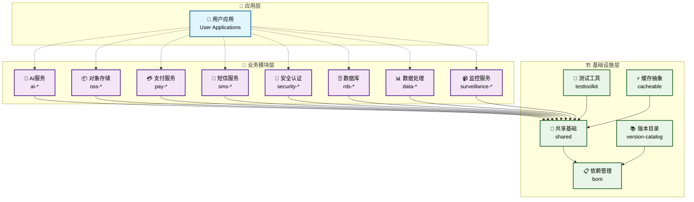
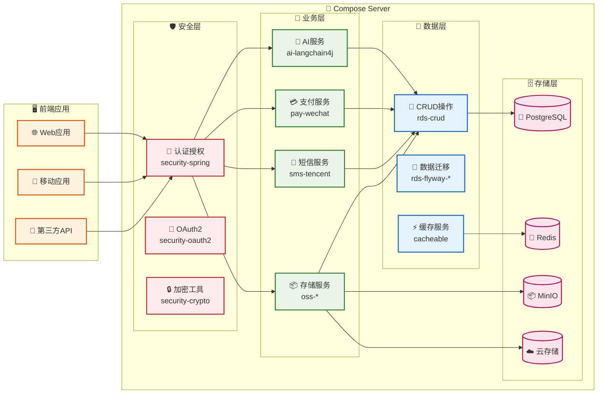
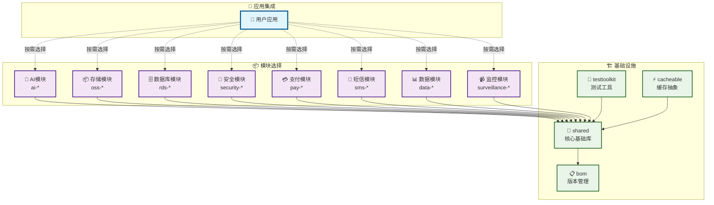

# Compose Server

<div align="center">

[](https://kotlinlang.org/)
[](https://spring.io/projects/spring-boot)
[](https://github.com/babyfish-ct/jimmer)

[](https://central.sonatype.com/search?q=g:io.github.truenine)
[](https://central.sonatype.com/search?q=g:io.github.truenine)
[](LICENSE)

[](https://github.com/TrueNine/compose-server/stargazers)
[](https://github.com/TrueNine/compose-server/network/members)
[](https://github.com/TrueNine/compose-server/issues)

</div>

---

<div align="center">

## 🚀 现代化企业级 Kotlin 服务端框架库

</div>

> **模块化 • 企业级 • 生产就绪**  
> 基于现代化技术栈构建的企业级服务端框架库，提供完整的模块化解决方案

**Compose Server** 是一个现代化的 Kotlin 企业级服务端框架库，采用模块化架构设计，提供 **15+ 核心业务模块**，涵盖安全认证、数据存储、AI集成、支付处理、消息通知等企业级功能。所有模块已发布至 **Maven 中央仓库**，支持按需选择和灵活集成，让开发者能够快速构建生产就绪的企业级应用。

### 🎯 目标用户群体

- **企业级应用开发者** - 需要快速构建可靠、可扩展的服务端应用
- **微服务架构团队** - 寻求统一技术栈和模块化解决方案
- **AI应用开发者** - 需要集成多种AI能力的现代化应用
- **多云存储用户** - 需要统一接口管理不同云服务商的存储服务

### 💼 核心使用场景

- **企业级Web应用** - 电商平台、管理系统、业务中台
- **微服务架构** - 分布式系统、云原生应用
- **AI驱动应用** - 智能客服、内容生成、数据分析
- **多云存储系统** - 文件管理、媒体处理、数据备份

---

## ✨ 核心特性

<div align="left">

### 🏗️ **模块化架构**
- **15+ 业务模块** - 清晰的功能边界和依赖关系
- **按需集成** - 灵活选择所需模块，避免冗余依赖
- **统一接口** - 一致的API设计，降低学习成本

### 🎯 **现代化技术栈**
- **Kotlin 2.2.0** - 现代化JVM语言，简洁高效
- **Spring Boot 3.5.4** - 企业级框架，生产就绪
- **Jimmer 0.9.105** - 现代化ORM，强类型安全

### 🤖 **AI能力集成**
- **LangChain4j** - 完整的AI应用开发框架
- **MCP协议** - 模型上下文协议支持
- **多模型支持** - 兼容主流AI服务提供商

### 📦 **多云存储统一**
- **统一接口** - 一套API适配多个云服务商
- **MinIO** - 私有云对象存储解决方案
- **公有云支持** - 阿里云OSS、华为云OBS、火山引擎TOS

### 🔐 **企业级安全**
- **Spring Security** - 完整的安全框架集成
- **OAuth2** - 标准化的认证授权
- **加密工具** - 常用加密算法封装

### 💳 **支付集成**
- **微信支付** - 完整的支付流程封装
- **统一接口** - 易于扩展其他支付方式

### 📱 **消息通知**
- **短信服务** - 腾讯云SMS集成
- **扩展性** - 支持多种通知渠道

### 🗄️ **数据处理**
- **CRUD操作** - 基于Jimmer的数据访问层
- **数据库迁移** - Flyway集成，版本化管理
- **PostgreSQL扩展** - 针对PostgreSQL的优化

</div>

---

## 🛠️ 技术栈

### 🏗️ 核心框架

| 技术 | 版本 | 选型理由 |
|------|------|----------|
| **[Kotlin](https://kotlinlang.org/)** | 2.2.0 | 现代化JVM语言，简洁高效，完全兼容Java生态 |
| **[Spring Boot](https://spring.io/projects/spring-boot)** | 3.5.4 | 企业级框架，生产就绪，丰富的生态系统 |
| **[Jimmer](https://github.com/babyfish-ct/jimmer)** | 0.9.105 | 现代化ORM框架，强类型安全，GraphQL风格查询 |
| **[Gradle](https://gradle.org/)** | 9.x | 强大的构建工具，支持Kotlin DSL和Version Catalog |

### 🗄️ 数据库与持久化

| 技术 | 版本 | 应用场景 |
|------|------|----------|
| **[PostgreSQL](https://www.postgresql.org/)** | 42.7.7 | 主数据库，世界上最先进的开源关系型数据库 |
| **[Flyway](https://flywaydb.org/)** | 11.10.5 | 数据库版本管理和迁移工具 |
| **[HikariCP](https://github.com/brettwooldridge/HikariCP)** | - | 高性能JDBC连接池，Spring Boot默认选择 |
| **[Caffeine](https://github.com/ben-manes/caffeine)** | 3.2.2 | 高性能本地缓存库，替代Guava Cache |

### 🤖 AI与机器学习

| 技术 | 版本 | 功能特性 |
|------|------|----------|
| **[LangChain4j](https://github.com/langchain4j/langchain4j)** | 1.2.0 | Java的AI应用开发框架，支持多种LLM |
| **[LangChain4j Community](https://github.com/langchain4j/langchain4j)** | 1.1.0-beta7 | 社区扩展，包含更多AI服务集成 |
| **[MCP Protocol](https://modelcontextprotocol.io/)** | 1.1.0-beta7 | 模型上下文协议，统一AI服务接口 |
| **[Ollama](https://ollama.ai/)** | 1.2.0 | 本地大模型运行平台，支持离线AI能力 |

### 📦 对象存储

| 服务商 | SDK版本 | 适用场景 |
|--------|---------|----------|
| **[MinIO](https://min.io/)** | 8.5.17 | 私有云存储，S3兼容，适合自建环境 |
| **[阿里云OSS](https://www.aliyun.com/product/oss)** | 3.18.3 | 公有云存储，国内访问速度快 |
| **[华为云OBS](https://www.huaweicloud.com/product/obs.html)** | 3.25.5 | 公有云存储，企业级可靠性 |
| **[火山引擎TOS](https://www.volcengine.com/products/tos)** | 2.9.4 | 公有云存储，字节跳动云服务 |

### 🔐 安全与认证

| 技术 | 版本 | 应用领域 |
|------|------|----------|
| **[Spring Security](https://spring.io/projects/spring-security)** | 6.5.2 | 企业级安全框架，认证授权核心 |
| **[OAuth2](https://oauth.net/2/)** | - | 标准化的认证授权协议 |
| **[JWT](https://jwt.io/)** | 4.5.0 | 无状态令牌，适合分布式系统 |
| **[BouncyCastle](https://www.bouncycastle.org/)** | 1.81 | 加密算法库，提供丰富的密码学功能 |

### 💳 支付与通信

| 服务 | SDK版本 | 集成能力 |
|------|---------|----------|
| **[微信支付](https://pay.weixin.qq.com/)** | 0.2.17 | 完整的支付流程封装，支持多种支付方式 |
| **[腾讯云SMS](https://cloud.tencent.com/product/sms)** | 3.1.1281 | 短信服务，支持验证码和通知消息 |

### 🔧 开发工具与测试

| 工具 | 版本 | 用途 |
|------|------|------|
| **[JUnit 5](https://junit.org/junit5/)** | 6.0.0-M2 | 现代化的Java测试框架 |
| **[MockK](https://mockk.io/)** | 1.14.5 | Kotlin专用的Mock框架 |
| **[TestContainers](https://www.testcontainers.org/)** | 1.21.3 | 集成测试容器化解决方案 |
| **[Spotless](https://github.com/diffplug/spotless)** | 7.2.1 | 代码格式化和风格检查工具 |

### 📊 数据处理与监控

| 技术 | 版本 | 应用场景 |
|------|------|----------|
| **[Jackson](https://github.com/FasterXML/jackson)** | 2.19.2 | JSON序列化反序列化，Spring Boot默认选择 |
| **[EasyExcel](https://github.com/alibaba/easyexcel)** | 4.0.3 | Excel文件处理，阿里巴巴开源 |
| **[Jsoup](https://jsoup.org/)** | 1.21.1 | HTML解析和网页数据提取 |
| **[Spring Boot Actuator](https://spring.io/guides/gs/actuator-service/)** | 3.5.4 | 应用监控和健康检查 |

---

## 🏗️ 模块架构

### 📊 架构概览

Compose Server 采用分层模块化架构，提供清晰的功能边界和灵活的集成方式：

<div align="center">



</div>

---

### 🎨 技术架构图

<div align="center">



</div>

### 🎯 模块分类

#### 🏛️ **基础设施模块**

| 模块 | 功能描述 | 使用场景 |
|------|----------|----------|
| **shared** | 核心基础库，提供通用工具类和基础抽象 | 所有业务模块的基础依赖 |
| **bom** | 依赖版本管理，统一控制所有模块的版本 | 项目依赖管理和版本控制 |
| **testtoolkit** | 测试工具集，提供测试基础设施和工具 | 单元测试、集成测试、性能测试 |
| **cacheable** | 缓存抽象层，提供统一的缓存接口 | 应用缓存、数据缓存、会话缓存 |
| **version-catalog** | Gradle版本目录，外部项目版本管理 | 外部项目集成和版本同步 |

#### 🤖 **AI服务模块**

| 模块 | 功能描述 | 使用场景 |
|------|----------|----------|
| **ai-shared** | AI服务通用抽象和接口定义 | AI能力的统一接口层 |
| **ai-langchain4j** | LangChain4j集成，支持多种LLM | 智能对话、内容生成、文档分析 |

#### 📦 **对象存储模块**

| 模块 | 功能描述 | 使用场景 |
|------|----------|----------|
| **oss-shared** | 对象存储统一接口和抽象 | 存储服务的统一访问层 |
| **oss-minio** | MinIO私有云存储实现 | 自建存储、开发测试环境 |
| **oss-aliyun-oss** | 阿里云OSS集成 | 国内公有云存储服务 |
| **oss-huawei-obs** | 华为云OBS集成 | 企业级公有云存储 |
| **oss-volcengine-tos** | 火山引擎TOS集成 | 字节跳动云存储服务 |

#### 🗄️ **数据库模块**

| 模块 | 功能描述 | 使用场景 |
|------|----------|----------|
| **rds-shared** | 数据库通用抽象和工具 | 数据访问层的基础设施 |
| **rds-crud** | 基于Jimmer的CRUD操作封装 | 标准的数据库增删改查 |
| **rds-jimmer-ext-postgres** | PostgreSQL的Jimmer扩展 | PostgreSQL特有功能支持 |
| **rds-flyway-migration-shared** | Flyway迁移通用工具 | 数据库版本管理基础 |
| **rds-flyway-migration-mysql8** | MySQL 8.x迁移支持 | MySQL数据库迁移 |
| **rds-flyway-migration-postgresql** | PostgreSQL迁移支持 | PostgreSQL数据库迁移 |

#### 🔐 **安全模块**

| 模块 | 功能描述 | 使用场景 |
|------|----------|----------|
| **security-spring** | Spring Security集成和配置 | Web应用安全、API认证 |
| **security-oauth2** | OAuth2认证授权实现 | 第三方登录、API授权 |
| **security-crypto** | 加密解密工具集 | 数据加密、密码处理 |

#### 💳 **支付模块**

| 模块 | 功能描述 | 使用场景 |
|------|----------|----------|
| **pay-shared** | 支付服务通用抽象 | 支付接口的统一定义 |
| **pay-wechat** | 微信支付集成 | 微信支付、小程序支付 |

#### 📱 **通信模块**

| 模块 | 功能描述 | 使用场景 |
|------|----------|----------|
| **sms-shared** | 短信服务通用抽象 | 短信发送的统一接口 |
| **sms-tencent** | 腾讯云SMS集成 | 验证码、通知短信 |

#### 📊 **数据处理模块**

| 模块 | 功能描述 | 使用场景 |
|------|----------|----------|
| **data-crawler** | 网页爬虫和数据抓取 | 数据采集、内容抓取 |
| **data-extract** | 数据提取和转换工具 | 数据清洗、格式转换 |

#### 📹 **监控模块**

| 模块 | 功能描述 | 使用场景 |
|------|----------|----------|
| **surveillance-shared** | 监控服务通用抽象 | 监控接口的统一定义 |
| **surveillance-hikvision** | 海康威视设备集成 | 视频监控、设备管理 |

### 🔗 依赖关系

#### 📊 核心依赖链

<div align="center">



</div>

#### 🔄 模块间协作关系

```mermaid
graph TB
    subgraph "🤖 AI 生态"
        AI_SHARED["ai-shared<br/>🔧 AI抽象接口"]
        AI_LC4J["ai-langchain4j<br/>🧠 LangChain4j集成"]
        AI_SHARED --> AI_LC4J
    end
    
    subgraph "📦 存储生态"
        OSS_SHARED["oss-shared<br/>🔧 存储抽象接口"]
        OSS_MINIO["oss-minio<br/>🏠 私有云存储"]
        OSS_ALIYUN["oss-aliyun-oss<br/>☁️ 阿里云OSS"]
        OSS_HUAWEI["oss-huawei-obs<br/>☁️ 华为云OBS"]
        OSS_VOLCENGINE["oss-volcengine-tos<br/>☁️ 火山引擎TOS"]
        
        OSS_SHARED --> OSS_MINIO
        OSS_SHARED --> OSS_ALIYUN
        OSS_SHARED --> OSS_HUAWEI
        OSS_SHARED --> OSS_VOLCENGINE
    end
    
    subgraph "🗄️ 数据生态"
        RDS_SHARED["rds-shared<br/>🔧 数据抽象接口"]
        RDS_CRUD["rds-crud<br/>📝 CRUD操作"]
        RDS_JIMMER["rds-jimmer-ext-postgres<br/>🐘 PostgreSQL扩展"]
        RDS_FLYWAY["rds-flyway-migration-*<br/>🔄 数据库迁移"]
        
        RDS_SHARED --> RDS_CRUD
        RDS_SHARED --> RDS_JIMMER
        RDS_SHARED --> RDS_FLYWAY
    end
    
    subgraph "🔐 安全生态"
        SEC_SPRING["security-spring<br/>🛡️ Spring Security"]
        SEC_OAUTH2["security-oauth2<br/>🎫 OAuth2认证"]
        SEC_CRYPTO["security-crypto<br/>🔒 加密工具"]
    end
    
    subgraph "💳 支付生态"
        PAY_SHARED["pay-shared<br/>🔧 支付抽象接口"]
        PAY_WECHAT["pay-wechat<br/>💚 微信支付"]
        PAY_SHARED --> PAY_WECHAT
    end
    
    subgraph "📱 通信生态"
        SMS_SHARED["sms-shared<br/>🔧 短信抽象接口"]
        SMS_TENCENT["sms-tencent<br/>☁️ 腾讯云SMS"]
        SMS_SHARED --> SMS_TENCENT
    end
    
    %% 样式定义
    classDef ai fill:#fff3e0,stroke:#f57c00,stroke-width:2px
    classDef storage fill:#e8f5e8,stroke:#388e3c,stroke-width:2px
    classDef data fill:#e3f2fd,stroke:#1976d2,stroke-width:2px
    classDef security fill:#ffebee,stroke:#d32f2f,stroke-width:2px
    classDef payment fill:#f3e5f5,stroke:#7b1fa2,stroke-width:2px
    classDef communication fill:#e0f2f1,stroke:#00796b,stroke-width:2px
    
    class AI_SHARED,AI_LC4J ai
    class OSS_SHARED,OSS_MINIO,OSS_ALIYUN,OSS_HUAWEI,OSS_VOLCENGINE storage
    class RDS_SHARED,RDS_CRUD,RDS_JIMMER,RDS_FLYWAY data
    class SEC_SPRING,SEC_OAUTH2,SEC_CRYPTO security
    class PAY_SHARED,PAY_WECHAT payment
    class SMS_SHARED,SMS_TENCENT communication
```

<div align="center">



</div>

#### 模块间集成

- **基础依赖**：所有业务模块都依赖 `shared` 模块
- **版本管理**：通过 `bom` 模块统一管理版本
- **测试支持**：`testtoolkit` 为所有模块提供测试基础设施
- **缓存集成**：`cacheable` 可与任意业务模块组合使用

### 📋 模块选择指南

#### 🎯 **按使用场景选择**

**基础Web应用**
```kotlin
// 必选模块
implementation("io.github.truenine:composeserver-shared")
implementation("io.github.truenine:composeserver-rds-shared")
implementation("io.github.truenine:composeserver-rds-crud")
implementation("io.github.truenine:composeserver-security-spring")
```

**AI驱动应用**
```kotlin
// 基础模块 + AI能力
implementation("io.github.truenine:composeserver-shared")
implementation("io.github.truenine:composeserver-ai-shared")
implementation("io.github.truenine:composeserver-ai-langchain4j")
```

**文件存储应用**
```kotlin
// 基础模块 + 对象存储
implementation("io.github.truenine:composeserver-shared")
implementation("io.github.truenine:composeserver-oss-shared")
// 选择存储实现（可多选）
implementation("io.github.truenine:composeserver-oss-minio")
implementation("io.github.truenine:composeserver-oss-aliyun-oss")
```

**电商支付应用**
```kotlin
// 基础模块 + 支付 + 短信
implementation("io.github.truenine:composeserver-shared")
implementation("io.github.truenine:composeserver-pay-shared")
implementation("io.github.truenine:composeserver-pay-wechat")
implementation("io.github.truenine:composeserver-sms-shared")
implementation("io.github.truenine:composeserver-sms-tencent")
```

#### 🔧 **按技术栈选择**

**PostgreSQL + Spring Security**
```kotlin
implementation("io.github.truenine:composeserver-rds-shared")
implementation("io.github.truenine:composeserver-rds-crud")
implementation("io.github.truenine:composeserver-rds-jimmer-ext-postgres")
implementation("io.github.truenine:composeserver-rds-flyway-migration-postgresql")
implementation("io.github.truenine:composeserver-security-spring")
implementation("io.github.truenine:composeserver-security-oauth2")
```

**多云存储 + 缓存**
```kotlin
implementation("io.github.truenine:composeserver-oss-shared")
implementation("io.github.truenine:composeserver-oss-minio")
implementation("io.github.truenine:composeserver-oss-aliyun-oss")
implementation("io.github.truenine:composeserver-cacheable")
```

#### ⚡ **性能优化建议**

1. **按需引入**：只选择实际需要的模块，避免不必要的依赖
2. **共享模块**：`shared` 模块是必需的，包含所有模块的基础功能
3. **版本管理**：使用 `bom` 模块确保版本一致性
4. **测试支持**：开发阶段引入 `testtoolkit` 提升测试效率

---

## 🚀 快速开始

### 📋 环境要求

在开始使用 Compose Server 之前，请确保您的开发环境满足以下要求：

| 环境 | 最低版本 | 推荐版本 | 说明 |
|------|----------|----------|------|
| **JDK** | 24+ | 24+ | 支持最新的 Java 特性和性能优化 |
| **Kotlin** | 2.2.0+ | 2.2.0+ | 现代化的 JVM 语言，完全兼容 Java |
| **Gradle** | 9.0+ | 9.x | 支持 Kotlin DSL 和 Version Catalog |
| **Spring Boot** | 3.5.0+ | 3.5.4+ | 企业级框架，生产就绪 |

### 📦 Maven 中央仓库

所有模块已发布至 Maven 中央仓库：[**io.github.truenine**](https://central.sonatype.com/search?q=g:io.github.truenine)

当前最新版本：**0.0.26**

### 🔧 依赖配置

#### 方式一：使用 Gradle Kotlin DSL（推荐）

**基础配置**

```kotlin
// build.gradle.kts
plugins {
    kotlin("jvm") version "2.2.0"
    kotlin("plugin.spring") version "2.2.0"
    id("org.springframework.boot") version "3.5.4"
    id("io.spring.dependency-management") version "1.1.7"
}

repositories {
    mavenCentral()
}

dependencies {
    // 核心基础模块（必需）
    implementation("io.github.truenine:composeserver-shared:0.0.26")
    
    // 数据库模块
    implementation("io.github.truenine:composeserver-rds-shared:0.0.26")
    implementation("io.github.truenine:composeserver-rds-crud:0.0.26")
    
    // Spring Boot 集成
    implementation("org.springframework.boot:spring-boot-starter-web")
    implementation("org.springframework.boot:spring-boot-starter-data-jpa")
    
    // 测试依赖
    testImplementation("io.github.truenine:composeserver-testtoolkit:0.0.26")
    testImplementation("org.springframework.boot:spring-boot-starter-test")
}
```

**完整示例配置**

```kotlin
// build.gradle.kts
plugins {
    kotlin("jvm") version "2.2.0"
    kotlin("plugin.spring") version "2.2.0"
    kotlin("plugin.jpa") version "2.2.0"
    id("org.springframework.boot") version "3.5.4"
    id("io.spring.dependency-management") version "1.1.7"
}

repositories {
    mavenCentral()
}

dependencies {
    // Compose Server 核心模块
    implementation("io.github.truenine:composeserver-shared:0.0.26")
    implementation("io.github.truenine:composeserver-rds-shared:0.0.26")
    implementation("io.github.truenine:composeserver-rds-crud:0.0.26")
    implementation("io.github.truenine:composeserver-security-spring:0.0.26")
    
    // 可选模块（按需选择）
    implementation("io.github.truenine:composeserver-oss-shared:0.0.26")
    implementation("io.github.truenine:composeserver-oss-minio:0.0.26")
    implementation("io.github.truenine:composeserver-ai-shared:0.0.26")
    implementation("io.github.truenine:composeserver-ai-langchain4j:0.0.26")
    
    // Spring Boot 依赖
    implementation("org.springframework.boot:spring-boot-starter-web")
    implementation("org.springframework.boot:spring-boot-starter-data-jpa")
    implementation("org.springframework.boot:spring-boot-starter-security")
    implementation("org.babyfish.jimmer:jimmer-spring-boot-starter:0.9.105")
    
    // 数据库
    runtimeOnly("org.postgresql:postgresql")
    
    // 测试
    testImplementation("io.github.truenine:composeserver-testtoolkit:0.0.26")
    testImplementation("org.springframework.boot:spring-boot-starter-test")
    testImplementation("org.testcontainers:postgresql")
}
```

#### 方式二：使用 Maven

**基础配置**

```xml
<!-- pom.xml -->
<properties>
    <kotlin.version>2.2.0</kotlin.version>
    <spring-boot.version>3.5.4</spring-boot.version>
    <compose-server.version>0.0.26</compose-server.version>
    <jimmer.version>0.9.105</jimmer.version>
</properties>

<dependencies>
    <!-- Compose Server 核心模块 -->
    <dependency>
        <groupId>io.github.truenine</groupId>
        <artifactId>composeserver-shared</artifactId>
        <version>${compose-server.version}</version>
    </dependency>
    
    <dependency>
        <groupId>io.github.truenine</groupId>
        <artifactId>composeserver-rds-shared</artifactId>
        <version>${compose-server.version}</version>
    </dependency>
    
    <dependency>
        <groupId>io.github.truenine</groupId>
        <artifactId>composeserver-rds-crud</artifactId>
        <version>${compose-server.version}</version>
    </dependency>
    
    <!-- Spring Boot 依赖 -->
    <dependency>
        <groupId>org.springframework.boot</groupId>
        <artifactId>spring-boot-starter-web</artifactId>
    </dependency>
    
    <dependency>
        <groupId>org.springframework.boot</groupId>
        <artifactId>spring-boot-starter-data-jpa</artifactId>
    </dependency>
    
    <!-- Jimmer ORM -->
    <dependency>
        <groupId>org.babyfish.jimmer</groupId>
        <artifactId>jimmer-spring-boot-starter</artifactId>
        <version>${jimmer.version}</version>
    </dependency>
    
    <!-- 数据库驱动 -->
    <dependency>
        <groupId>org.postgresql</groupId>
        <artifactId>postgresql</artifactId>
        <scope>runtime</scope>
    </dependency>
    
    <!-- 测试依赖 -->
    <dependency>
        <groupId>io.github.truenine</groupId>
        <artifactId>composeserver-testtoolkit</artifactId>
        <version>${compose-server.version}</version>
        <scope>test</scope>
    </dependency>
</dependencies>
```

### 🔄 版本管理

#### 使用 Gradle Version Catalog（推荐）

对于 Gradle 9.x 项目，推荐使用 **Gradle Version Catalog** 统一管理版本：

**settings.gradle.kts**

```kotlin
dependencyResolutionManagement {
    repositoriesMode.set(RepositoriesMode.FAIL_ON_PROJECT_REPOS)
    repositories {
        mavenCentral()
    }
    
    versionCatalogs {
        // 使用 Compose Server 提供的版本目录
        create("cs") { 
            from("io.github.truenine:composeserver-version-catalog:0.0.26") 
        }
        
        // 项目自定义版本目录（可选）
        create("libs") { 
            from(files("gradle/libs.versions.toml")) 
        }
    }
}
```

**build.gradle.kts**

```kotlin
dependencies {
    // 使用版本目录中的依赖
    implementation(cs.composeserver.shared)
    implementation(cs.composeserver.rds.shared)
    implementation(cs.composeserver.rds.crud)
    
    // Spring Boot 依赖
    implementation(cs.springframework.boot.starter.web)
    implementation(cs.springframework.boot.starter.data.jpa)
    
    testImplementation(cs.composeserver.testtoolkit)
}
```

#### 使用 BOM（Bill of Materials）

**Gradle 配置**

```kotlin
dependencies {
    // 导入 BOM，统一管理版本
    implementation(platform("io.github.truenine:composeserver-bom:0.0.26"))
    
    // 无需指定版本，由 BOM 管理
    implementation("io.github.truenine:composeserver-shared")
    implementation("io.github.truenine:composeserver-rds-shared")
    implementation("io.github.truenine:composeserver-rds-crud")
}
```

**Maven 配置**

```xml
<dependencyManagement>
    <dependencies>
        <dependency>
            <groupId>io.github.truenine</groupId>
            <artifactId>composeserver-bom</artifactId>
            <version>0.0.26</version>
            <type>pom</type>
            <scope>import</scope>
        </dependency>
    </dependencies>
</dependencyManagement>

<dependencies>
    <!-- 无需指定版本，由 BOM 管理 -->
    <dependency>
        <groupId>io.github.truenine</groupId>
        <artifactId>composeserver-shared</artifactId>
    </dependency>
    
    <dependency>
        <groupId>io.github.truenine</groupId>
        <artifactId>composeserver-rds-shared</artifactId>
    </dependency>
</dependencies>
```

### 📝 基本使用示例

#### 1. 创建 Spring Boot 应用

```kotlin
// Application.kt
@SpringBootApplication
class ComposeServerApplication

fun main(args: Array<String>) {
    runApplication<ComposeServerApplication>(*args)
}
```

#### 2. 配置数据库连接

```yaml
# application.yml
spring:
  datasource:
    url: jdbc:postgresql://localhost:5432/compose_server
    username: postgres
    password: password
    driver-class-name: org.postgresql.Driver
    
  jpa:
    hibernate:
      ddl-auto: validate
    show-sql: true
    
jimmer:
  show-sql: true
  pretty-sql: true
  database-validation-mode: ERROR
```

#### 3. 创建实体类

```kotlin
// User.kt
import org.babyfish.jimmer.sql.*
import java.time.LocalDateTime

@Entity
@Table(name = "users")
interface User {
    
    @Id
    @GeneratedValue(strategy = GenerationType.IDENTITY)
    val id: Long
    
    val username: String
    
    val email: String
    
    val createdAt: LocalDateTime
    
    val updatedAt: LocalDateTime
}
```

#### 4. 创建 Repository

```kotlin
// UserRepository.kt
import org.babyfish.jimmer.spring.repository.KRepository
import org.springframework.stereotype.Repository

@Repository
interface UserRepository : KRepository<User, Long> {
    
    fun findByUsername(username: String): User?
    
    fun findByEmail(email: String): User?
    
    fun existsByUsername(username: String): Boolean
}
```

#### 5. 创建 Service

```kotlin
// UserService.kt
import org.springframework.stereotype.Service
import org.springframework.transaction.annotation.Transactional

@Service
@Transactional(readOnly = true)
class UserService(
    private val userRepository: UserRepository
) {
    
    fun findById(id: Long): User? {
        return userRepository.findNullable(id)
    }
    
    fun findByUsername(username: String): User? {
        return userRepository.findByUsername(username)
    }
    
    @Transactional
    fun createUser(username: String, email: String): User {
        val user = User {
            username = username
            email = email
            createdAt = LocalDateTime.now()
            updatedAt = LocalDateTime.now()
        }
        return userRepository.save(user)
    }
}
```

#### 6. 创建 Controller

```kotlin
// UserController.kt
import org.springframework.web.bind.annotation.*

@RestController
@RequestMapping("/api/users")
class UserController(
    private val userService: UserService
) {
    
    @GetMapping("/{id}")
    fun getUser(@PathVariable id: Long): User? {
        return userService.findById(id)
    }
    
    @PostMapping
    fun createUser(@RequestBody request: CreateUserRequest): User {
        return userService.createUser(request.username, request.email)
    }
}

data class CreateUserRequest(
    val username: String,
    val email: String
)
```

### 🧪 测试配置

#### 单元测试示例

```kotlin
// UserServiceTest.kt
import io.github.truenine.composeserver.testtoolkit.testcontainers.IDatabasePostgresqlContainer
import org.assertj.core.api.Assertions.assertThat
import org.junit.jupiter.api.Test
import org.springframework.beans.factory.annotation.Autowired
import org.springframework.boot.test.context.SpringBootTest
import org.springframework.transaction.annotation.Transactional

@SpringBootTest
@Transactional
class UserServiceTest : IDatabasePostgresqlContainer {
    
    @Autowired
    private lateinit var userService: UserService
    
    @Test
    fun `should create user successfully`() {
        // Given
        val username = "testuser"
        val email = "test@example.com"
        
        // When
        val user = userService.createUser(username, email)
        
        // Then
        assertThat(user.username).isEqualTo(username)
        assertThat(user.email).isEqualTo(email)
        assertThat(user.id).isNotNull()
    }
}
```

### 🚀 运行应用

1. **启动数据库**（使用 Docker）

```bash
docker run --name postgres \
  -e POSTGRES_DB=compose_server \
  -e POSTGRES_USER=postgres \
  -e POSTGRES_PASSWORD=password \
  -p 5432:5432 \
  -d postgres:16
```

2. **运行应用**

```bash
# Gradle
./gradlew bootRun

# Maven
mvn spring-boot:run
```

3. **测试 API**

```bash
# 创建用户
curl -X POST http://localhost:8080/api/users \
  -H "Content-Type: application/json" \
  -d '{"username":"john","email":"john@example.com"}'

# 查询用户
curl http://localhost:8080/api/users/1
```

### 📚 下一步

- 查看 [模块架构说明](#-模块架构) 了解更多可用模块
- 参考 [版本兼容性矩阵](#-版本兼容性) 选择合适的版本
- 访问 [API 文档](https://javadoc.io/doc/io.github.truenine) 获取详细的 API 说明
- 查看 [GitHub 仓库](https://github.com/TrueNine/compose-server) 获取更多示例

---

## 📚 文档和资源

### 📖 API 文档

- **[在线 API 文档](https://javadoc.io/doc/io.github.truenine)** - 完整的 Javadoc API 文档
- **[GitHub 仓库](https://github.com/TrueNine/compose-server)** - 源码、示例和最新更新
- **[Maven 中央仓库](https://central.sonatype.com/search?q=g:io.github.truenine)** - 所有已发布的模块和版本
- **[版本发布记录](https://github.com/TrueNine/compose-server/releases)** - 详细的版本更新日志

### 🎯 示例项目

- **[快速开始示例](https://github.com/TrueNine/compose-server/tree/main/examples/quickstart)** - 基础 Web 应用示例
- **[AI 集成示例](https://github.com/TrueNine/compose-server/tree/main/examples/ai-demo)** - LangChain4j 和 MCP 协议使用示例
- **[多云存储示例](https://github.com/TrueNine/compose-server/tree/main/examples/storage-demo)** - 对象存储服务集成示例
- **[支付集成示例](https://github.com/TrueNine/compose-server/tree/main/examples/payment-demo)** - 微信支付集成示例
- **[完整企业应用](https://github.com/TrueNine/compose-server/tree/main/examples/enterprise-app)** - 包含多个模块的完整应用示例

### 🛠️ 开发者资源

- **[开发指南](https://github.com/TrueNine/compose-server/wiki/Development-Guide)** - 项目开发和贡献指南
- **[架构设计文档](https://github.com/TrueNine/compose-server/wiki/Architecture)** - 详细的架构设计说明
- **[模块开发指南](https://github.com/TrueNine/compose-server/wiki/Module-Development)** - 如何开发和扩展模块
- **[测试指南](https://github.com/TrueNine/compose-server/wiki/Testing-Guide)** - 单元测试和集成测试最佳实践
- **[性能优化指南](https://github.com/TrueNine/compose-server/wiki/Performance-Optimization)** - 性能调优建议

### 🤝 社区与支持

#### 问题反馈

- **[GitHub Issues](https://github.com/TrueNine/compose-server/issues)** - 报告 Bug 和功能请求
- **[Bug 报告模板](https://github.com/TrueNine/compose-server/issues/new?template=bug_report.md)** - 使用标准模板报告问题
- **[功能请求模板](https://github.com/TrueNine/compose-server/issues/new?template=feature_request.md)** - 提交新功能建议

#### 社区交流

- **[GitHub Discussions](https://github.com/TrueNine/compose-server/discussions)** - 技术讨论和经验分享
- **[QQ 群](https://qm.qq.com/cgi-bin/qm/qr?k=compose-server)** - 中文技术交流群
- **[微信群](https://github.com/TrueNine/compose-server/wiki/WeChat-Group)** - 扫码加入微信技术群
- **[Stack Overflow](https://stackoverflow.com/questions/tagged/compose-server)** - 使用 `compose-server` 标签提问

#### 贡献指南

- **[贡献指南](https://github.com/TrueNine/compose-server/blob/main/CONTRIBUTING.md)** - 如何为项目做贡献
- **[代码规范](https://github.com/TrueNine/compose-server/wiki/Code-Style)** - 代码风格和规范要求
- **[提交规范](https://github.com/TrueNine/compose-server/wiki/Commit-Convention)** - Git 提交信息规范
- **[Pull Request 模板](https://github.com/TrueNine/compose-server/blob/main/.github/pull_request_template.md)** - PR 提交模板

### 📊 项目统计

- **[代码质量报告](https://sonarcloud.io/project/overview?id=TrueNine_compose-server)** - SonarCloud 代码质量分析
- **[依赖安全扫描](https://github.com/TrueNine/compose-server/security/advisories)** - 安全漏洞报告
- **[构建状态](https://github.com/TrueNine/compose-server/actions)** - CI/CD 构建状态
- **[测试覆盖率](https://codecov.io/gh/TrueNine/compose-server)** - 代码测试覆盖率报告

---

## 🔧 版本兼容性矩阵

### 📊 主要版本兼容性

| Compose Server | Spring Boot | Kotlin | JDK | Jimmer | Gradle | 发布状态 |
|----------------|-------------|--------|-----|--------|--------|----------|
| **0.0.26** | 3.5.4 | 2.2.0 | 24+ | 0.9.105 | 9.x | ✅ **当前版本** |
| 0.0.25 | 3.5.3 | 2.2.0 | 24+ | 0.9.102 | 9.x | 🔄 维护中 |
| 0.0.24 | 3.5.2 | 2.1.0 | 21+ | 0.9.100 | 8.x | ⚠️ 不推荐 |
| 0.0.23 | 3.5.1 | 2.1.0 | 21+ | 0.9.98 | 8.x | ❌ 已停止维护 |
| 0.0.22 | 3.4.5 | 2.0.20 | 21+ | 0.9.95 | 8.x | ❌ 已停止维护 |

### 🎯 版本选择建议

#### ✅ **推荐版本组合**

**生产环境（推荐）**
```kotlin
// 最新稳定版本，推荐用于生产环境
Compose Server: 0.0.26
Spring Boot: 3.5.4
Kotlin: 2.2.0
JDK: 24+
Jimmer: 0.9.105
Gradle: 9.x
```

**保守选择（稳定优先）**
```kotlin
// 经过充分测试的版本组合
Compose Server: 0.0.25
Spring Boot: 3.5.3
Kotlin: 2.2.0
JDK: 24+
Jimmer: 0.9.102
Gradle: 9.x
```

#### ⚠️ **版本选择注意事项**

1. **JDK 版本要求**
   - **JDK 24+** 是必需的，支持最新的 Java 特性和性能优化
   - 不支持 JDK 21 以下版本
   - 推荐使用 **OpenJDK 24** 或 **Oracle JDK 24**

2. **Kotlin 版本兼容性**
   - **Kotlin 2.2.0** 是当前支持的版本
   - 不向下兼容 Kotlin 2.1.x 及以下版本
   - 支持所有 Kotlin 2.2.x 补丁版本

3. **Spring Boot 版本要求**
   - 最低支持 **Spring Boot 3.5.0**
   - 推荐使用最新的 3.5.x 版本
   - 不支持 Spring Boot 3.4.x 及以下版本

4. **Gradle 版本要求**
   - 最低支持 **Gradle 9.0**
   - 推荐使用 **Gradle 9.x** 最新版本
   - 支持 Kotlin DSL 和 Version Catalog

### 🔄 升级指南

#### 从 0.0.25 升级到 0.0.26

**主要变更**
- Spring Boot 升级至 3.5.4
- Jimmer 升级至 0.9.105
- 新增 AI 模块功能增强
- 优化对象存储模块性能

**升级步骤**
```kotlin
// 1. 更新版本号
dependencies {
    implementation("io.github.truenine:composeserver-shared:0.0.26")
    // 其他模块同步更新到 0.0.26
}

// 2. 更新 Spring Boot 版本
plugins {
    id("org.springframework.boot") version "3.5.4"
}

// 3. 更新 Jimmer 版本
dependencies {
    implementation("org.babyfish.jimmer:jimmer-spring-boot-starter:0.9.105")
}
```

**兼容性检查**
- ✅ API 完全向下兼容
- ✅ 配置文件无需修改
- ✅ 数据库结构无变更
- ⚠️ 建议重新测试 AI 相关功能

#### 从 0.0.24 及以下版本升级

**重要提醒**：从 0.0.24 及以下版本升级需要特别注意以下变更：

1. **JDK 版本要求变更**
   ```bash
   # 旧版本支持 JDK 21+
   # 新版本要求 JDK 24+
   java -version  # 确认 JDK 版本
   ```

2. **Kotlin 版本升级**
   ```kotlin
   // 更新 Kotlin 版本
   plugins {
       kotlin("jvm") version "2.2.0"
       kotlin("plugin.spring") version "2.2.0"
   }
   ```

3. **依赖配置调整**
   ```kotlin
   // 使用 BOM 管理版本（推荐）
   dependencies {
       implementation(platform("io.github.truenine:composeserver-bom:0.0.26"))
       implementation("io.github.truenine:composeserver-shared")
   }
   ```

### 🛠️ 版本管理最佳实践

#### 1. **使用 BOM 统一版本管理**

```kotlin
// build.gradle.kts
dependencies {
    // 使用 BOM 确保版本一致性
    implementation(platform("io.github.truenine:composeserver-bom:0.0.26"))
    
    // 无需指定版本，由 BOM 管理
    implementation("io.github.truenine:composeserver-shared")
    implementation("io.github.truenine:composeserver-rds-shared")
    implementation("io.github.truenine:composeserver-rds-crud")
}
```

#### 2. **使用 Version Catalog**

```kotlin
// settings.gradle.kts
dependencyResolutionManagement {
    versionCatalogs {
        create("cs") { 
            from("io.github.truenine:composeserver-version-catalog:0.0.26") 
        }
    }
}

// build.gradle.kts
dependencies {
    implementation(cs.composeserver.shared)
    implementation(cs.composeserver.rds.shared)
}
```

#### 3. **版本锁定策略**

```kotlin
// gradle.properties
# 锁定版本，确保构建可重现
systemProp.org.gradle.dependency.verification=strict

# build.gradle.kts
configurations.all {
    resolutionStrategy {
        // 强制使用指定版本
        force("io.github.truenine:composeserver-shared:0.0.26")
        
        // 缓存动态版本
        cacheDynamicVersionsFor(10, "minutes")
        cacheChangingModulesFor(0, "seconds")
    }
}
```

### 📋 兼容性测试清单

升级版本后，建议按照以下清单进行兼容性测试：

#### ✅ **基础功能测试**
- [ ] 应用启动正常
- [ ] 数据库连接正常
- [ ] 基本 CRUD 操作正常
- [ ] 安全认证功能正常

#### ✅ **模块功能测试**
- [ ] AI 模块功能正常（如使用）
- [ ] 对象存储功能正常（如使用）
- [ ] 支付模块功能正常（如使用）
- [ ] 短信服务功能正常（如使用）

#### ✅ **性能测试**
- [ ] 应用启动时间无明显增加
- [ ] 内存使用量在合理范围
- [ ] 数据库查询性能无退化
- [ ] API 响应时间正常

#### ✅ **集成测试**
- [ ] 单元测试全部通过
- [ ] 集成测试全部通过
- [ ] 端到端测试正常
- [ ] 容器化部署正常

### 🔗 相关资源

- **[详细升级指南](https://github.com/TrueNine/compose-server/wiki/Upgrade-Guide)** - 完整的版本升级文档
- **[破坏性变更日志](https://github.com/TrueNine/compose-server/wiki/Breaking-Changes)** - 各版本的重要变更
- **[版本发布记录](https://github.com/TrueNine/compose-server/releases)** - 详细的发布说明
- **[迁移工具](https://github.com/TrueNine/compose-server/tree/main/tools/migration)** - 自动化迁移脚本
- **[兼容性测试套件](https://github.com/TrueNine/compose-server/tree/main/compatibility-tests)** - 版本兼容性测试工具

### 💡 获取帮助

如果在版本升级过程中遇到问题：

1. **查看文档** - 先查阅 [升级指南](https://github.com/TrueNine/compose-server/wiki/Upgrade-Guide)
2. **搜索问题** - 在 [GitHub Issues](https://github.com/TrueNine/compose-server/issues) 中搜索相关问题
3. **提交问题** - 使用 [Bug 报告模板](https://github.com/TrueNine/compose-server/issues/new?template=bug_report.md) 报告问题
4. **社区讨论** - 在 [GitHub Discussions](https://github.com/TrueNine/compose-server/discussions) 中寻求帮助

### 🌐 相关资源

#### 技术栈文档

- **[Kotlin 官方文档](https://kotlinlang.org/docs/)** - Kotlin 语言官方指南
- **[Spring Boot 官方文档](https://spring.io/projects/spring-boot)** - Spring Boot 框架文档
- **[Jimmer 官方文档](https://babyfish-ct.github.io/jimmer-doc/)** - Jimmer ORM 框架文档
- **[Gradle 官方文档](https://docs.gradle.org/)** - Gradle 构建工具文档

#### AI 和机器学习

- **[LangChain4j 文档](https://docs.langchain4j.dev/)** - LangChain4j 框架文档
- **[MCP 协议规范](https://modelcontextprotocol.io/)** - 模型上下文协议官方文档
- **[Ollama 文档](https://ollama.ai/docs)** - 本地大模型运行平台文档

#### 云服务文档

- **[MinIO 文档](https://docs.min.io/)** - MinIO 对象存储文档
- **[阿里云 OSS 文档](https://help.aliyun.com/product/31815.html)** - 阿里云对象存储服务文档
- **[华为云 OBS 文档](https://support.huaweicloud.com/obs/)** - 华为云对象存储服务文档
- **[火山引擎 TOS 文档](https://www.volcengine.com/docs/6349)** - 火山引擎对象存储文档

### 📧 联系我们

- **项目维护者**: [TrueNine Team](https://github.com/TrueNine)
- **邮箱**: compose-server@truenine.io
- **官方网站**: [https://compose-server.truenine.io](https://compose-server.truenine.io)

---

💡 **提示**: 如果您在使用过程中遇到问题，建议先查看 [FAQ](https://github.com/TrueNine/compose-server/wiki/FAQ) 和 [常见问题解决方案](https://github.com/TrueNine/compose-server/wiki/Troubleshooting)。

## 📄 许可证

本项目采用 **[GNU Lesser General Public License v2.1](LICENSE)** 开源协议。

### 📋 许可证要点

- ✅ **商业使用** - 允许在商业项目中使用
- ✅ **修改和分发** - 允许修改源码并重新分发
- ✅ **专利授权** - 提供明确的专利授权
- ✅ **私人使用** - 允许私人和内部使用
- ⚠️ **Copyleft** - 修改后的库必须以相同许可证发布
- ⚠️ **披露源码** - 分发时必须提供源码或源码获取方式
- ⚠️ **许可证和版权声明** - 必须包含原始许可证和版权声明

### 🔗 许可证兼容性

LGPL 2.1 允许与以下许可证的项目集成：
- **MIT License** - 完全兼容
- **Apache License 2.0** - 完全兼容
- **BSD License** - 完全兼容
- **GPL 2.0/3.0** - 向上兼容

## 📊 项目统计

<div align="center">

### ⭐ GitHub 统计

[](https://github.com/TrueNine/compose-server/stargazers)
[](https://github.com/TrueNine/compose-server/network/members)
[](https://github.com/TrueNine/compose-server/issues)
[](https://github.com/TrueNine/compose-server/pulls)

### 📈 Star History

[](https://star-history.com/#TrueNine/compose-server&Date)

### 📦 Maven Central 统计

[](https://central.sonatype.com/search?q=g:io.github.truenine)
[](https://central.sonatype.com/search?q=g:io.github.truenine)

</div>

## 🙏 特别鸣谢

### 🏗️ 核心技术栈

感谢以下优秀的开源项目和技术，让 Compose Server 得以构建：

#### 🎯 **语言与框架**
- [**Kotlin**](https://kotlinlang.org/) - 现代化的 JVM 语言，简洁优雅，完全兼容 Java 生态
- [**Spring Boot**](https://spring.io/projects/spring-boot) - 企业级 Java 框架，提供强大的基础设施和生态系统
- [**Spring Framework**](https://spring.io/projects/spring-framework) - 全面的编程和配置模型，Java 企业应用的基石

#### 🗄️ **数据访问与持久化**
- [**Jimmer**](https://github.com/babyfish-ct/jimmer) - 革命性的现代化 ORM 框架，提供 GraphQL 风格的查询体验
- [**PostgreSQL**](https://www.postgresql.org/) - 世界上最先进的开源关系型数据库系统
- [**Flyway**](https://flywaydb.org/) - 数据库版本管理和迁移工具，确保数据库结构的一致性
- [**HikariCP**](https://github.com/brettwooldridge/HikariCP) - 高性能的 JDBC 连接池，Spring Boot 的默认选择

#### 🔧 **构建与工具**
- [**Gradle**](https://gradle.org/) - 强大灵活的构建工具，支持 Kotlin DSL 和复杂的模块化项目
- [**Kotlin Symbol Processing (KSP)**](https://github.com/google/ksp) - Kotlin 的代码生成框架，提供高效的编译时处理

#### 🔐 **安全与认证**
- [**Spring Security**](https://spring.io/projects/spring-security) - 功能强大且高度可定制的身份验证和访问控制框架
- [**BouncyCastle**](https://www.bouncycastle.org/) - 全面的加密算法库，提供丰富的密码学功能

#### 🤖 **AI 与机器学习**
- [**LangChain4j**](https://github.com/langchain4j/langchain4j) - Java 生态的 AI 应用开发框架，支持多种大语言模型
- [**Ollama**](https://ollama.ai/) - 本地大模型运行平台，支持离线 AI 能力
- [**Model Context Protocol (MCP)**](https://modelcontextprotocol.io/) - 统一的 AI 服务接口协议

#### 📦 **对象存储**
- [**MinIO**](https://min.io/) - 高性能的 S3 兼容对象存储服务，适合私有云部署
- [**阿里云 OSS SDK**](https://github.com/aliyun/aliyun-oss-java-sdk) - 阿里云对象存储服务的官方 Java SDK
- [**华为云 OBS SDK**](https://github.com/huaweicloud/huaweicloud-sdk-java-obs) - 华为云对象存储服务的官方 Java SDK
- [**火山引擎 TOS SDK**](https://github.com/volcengine/ve-tos-java-sdk) - 火山引擎对象存储服务的官方 Java SDK

#### 🧪 **测试与质量保证**
- [**JUnit 5**](https://junit.org/junit5/) - 现代化的 Java 测试框架，支持参数化测试和动态测试
- [**MockK**](https://mockk.io/) - Kotlin 专用的 Mock 框架，提供强大的模拟功能
- [**TestContainers**](https://www.testcontainers.org/) - 集成测试容器化解决方案，确保测试环境的一致性
- [**Spotless**](https://github.com/diffplug/spotless) - 代码格式化和风格检查工具

#### 📊 **数据处理与工具**
- [**Jackson**](https://github.com/FasterXML/jackson) - 高性能的 JSON 处理库，Spring Boot 的默认选择
- [**EasyExcel**](https://github.com/alibaba/easyexcel) - 阿里巴巴开源的 Excel 处理工具，内存友好
- [**Caffeine**](https://github.com/ben-manes/caffeine) - 高性能的 Java 缓存库，基于 Google Guava
- [**Jsoup**](https://jsoup.org/) - Java HTML 解析器，用于网页数据提取和处理

### 👥 贡献者

感谢所有为 Compose Server 项目做出贡献的开发者：

<div align="center">

[](https://github.com/TrueNine/compose-server/graphs/contributors)

</div>

### 🌟 社区支持

特别感谢以下社区和平台的支持：

- **[GitHub](https://github.com/)** - 提供优秀的代码托管和协作平台
- **[Maven Central](https://central.sonatype.com/)** - 提供可靠的依赖分发服务
- **[JetBrains](https://www.jetbrains.com/)** - 提供优秀的开发工具支持
- **[Kotlin 社区](https://kotlinlang.org/community/)** - 活跃的技术社区和丰富的学习资源

## 🤝 参与贡献

我们欢迎并感谢任何形式的贡献！

### 🎯 贡献方式

- **🐛 报告 Bug** - [提交 Issue](https://github.com/TrueNine/compose-server/issues/new?template=bug_report.md)
- **💡 功能建议** - [功能请求](https://github.com/TrueNine/compose-server/issues/new?template=feature_request.md)
- **📝 改进文档** - 帮助完善项目文档
- **🔧 提交代码** - [创建 Pull Request](https://github.com/TrueNine/compose-server/compare)
- **💬 参与讨论** - [GitHub Discussions](https://github.com/TrueNine/compose-server/discussions)

### 📋 贡献指南

在开始贡献之前，请阅读我们的 **[贡献指南](https://github.com/TrueNine/compose-server/blob/main/CONTRIBUTING.md)**，了解：

- 代码风格和规范要求
- 提交信息格式规范
- Pull Request 流程
- 测试要求和标准

### 🏆 贡献者权益

- **🎖️ 贡献者徽章** - 在项目中展示您的贡献
- **📢 社区认可** - 在发布说明中感谢您的贡献
- **🎁 专属权益** - 优先获得新功能预览和技术支持
- **🤝 技术交流** - 加入核心贡献者技术交流群

---

<div align="center">

### 💝 如果这个项目对您有帮助，请给我们一个 ⭐ Star！

**您的支持是我们持续改进的动力** 🚀

[](https://github.com/TrueNine/compose-server)
[](https://central.sonatype.com/search?q=g:io.github.truenine)

</div>
