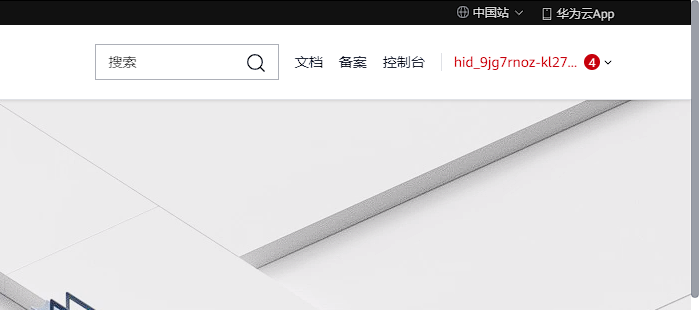
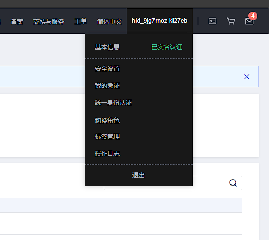
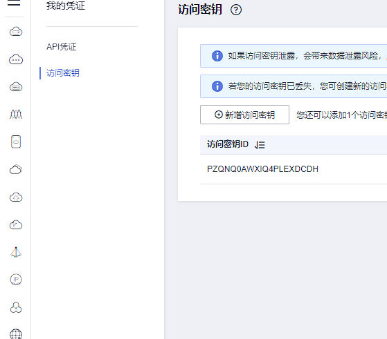
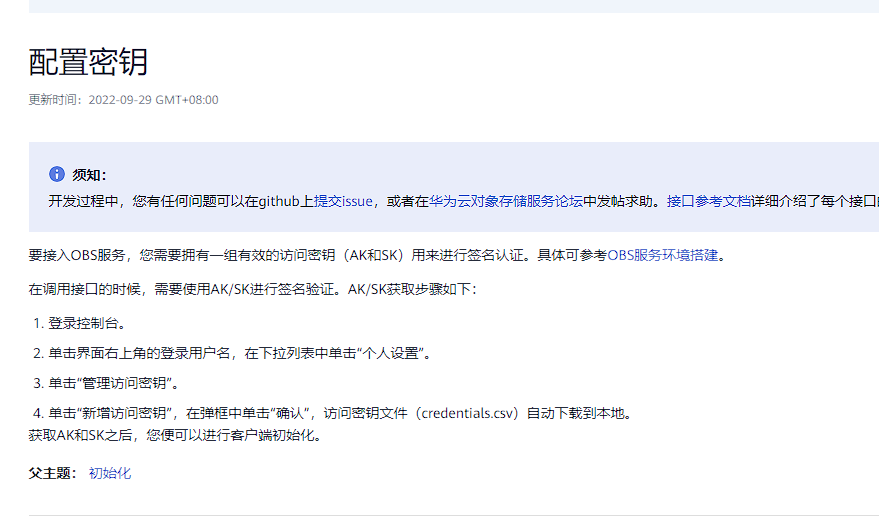
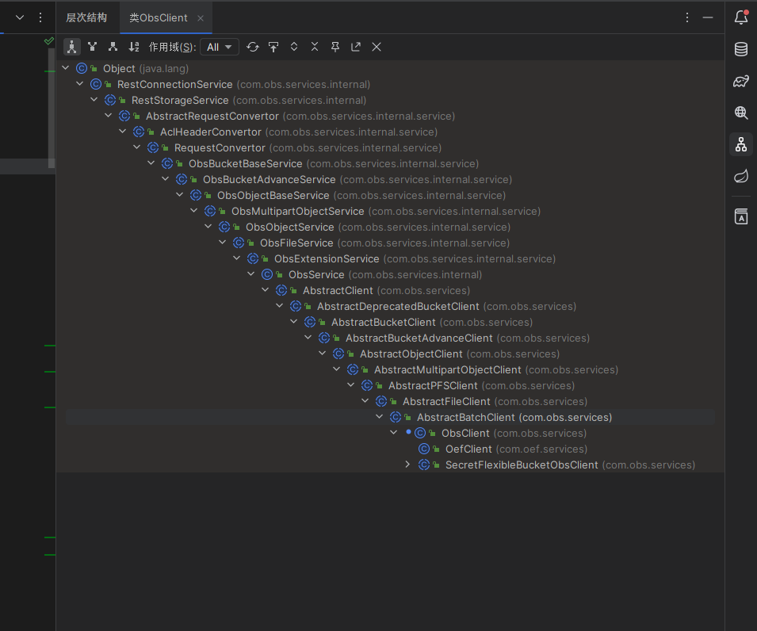

声明一点，华为也是跟别的厂子一样，文档狗屎，不喜欢更新，**用你麻痹**。

# 密钥获取 2023-04

- 右上角控制台

- 右上角我的凭证
  

- 左侧访问密钥
  

- 另外晒一张官方文档咋说的？？？
  
  去你妈个比

# 端点获取

又是一个傻逼设计，哎！就是不明着说，就是玩儿，去你麻痹，就是得让你读文档

[端点说明](https://support.huaweicloud.com/productdesc-obs/obs_03_0152.html)
[端点表](https://developer.huaweicloud.com/endpoint?OBS)

