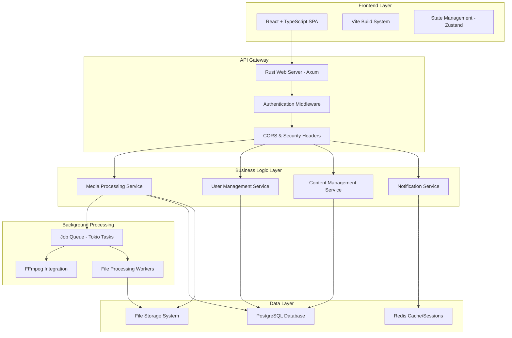

# Design Document

## Overview

This document outlines the architectural design for refactoring MediaCMS from Django + React to TypeScript + Rust. The new architecture will maintain all existing functionality while providing improved performance, type safety, and maintainability. The system will be built as a modern web application with a Rust backend API and TypeScript React frontend.

## Architecture

### High-Level Architecture



### Technology Stack

**Backend:**
- **Web Framework:** Axum (async, performant, type-safe)
- **Database ORM:** SQLx (compile-time checked queries)
- **Authentication:** JWT tokens + session management
- **Background Jobs:** Tokio tasks with persistent queue
- **File Processing:** FFmpeg via tokio::process
- **API Documentation:** OpenAPI 3.0 with automated generation

**Frontend:**
- **Framework:** React 18 with TypeScript
- **Build Tool:** Vite (fast development, optimized builds)
- **State Management:** Zustand (lightweight, TypeScript-first)
- **HTTP Client:** Axios with generated TypeScript types
- **UI Components:** Maintain existing component structure
- **Styling:** SCSS with CSS modules

**Infrastructure:**
- **Database:** PostgreSQL (same schema, migrated)
- **Cache:** Redis (sessions, caching, job queue metadata)
- **File Storage:** Local filesystem (same structure)
- **Reverse Proxy:** Nginx (same configuration patterns)

## Components and Interfaces

### Backend Components

#### 1. Web Server (Axum)

```rust
// Main application structure
pub struct AppState {
    pub db: PgPool,
    pub redis: RedisPool,
    pub config: AppConfig,
    pub job_queue: JobQueue,
}

// Route handlers
pub mod handlers {
    pub mod media;
    pub mod users;
    pub mod auth;
    pub mod playlists;
    pub mod comments;
}
```

**Key Features:**
- Async request handling with high concurrency
- Middleware for authentication, CORS, logging
- OpenAPI documentation generation
- Request/response validation with serde
- Error handling with structured error types

#### 2. Database Layer (SQLx)

```rust
// Database models
#[derive(sqlx::FromRow, Serialize, Deserialize)]
pub struct Media {
    pub id: i32,
    pub friendly_token: String,
    pub title: String,
    pub description: Option<String>,
    pub user_id: i32,
    pub media_type: MediaType,
    pub state: MediaState,
    pub duration: Option<f64>,
    pub add_date: DateTime<Utc>,
    // ... other fields
}

// Repository pattern for data access
pub trait MediaRepository {
    async fn create(&self, media: CreateMedia) -> Result<Media>;
    async fn find_by_token(&self, token: &str) -> Result<Option<Media>>;
    async fn update(&self, id: i32, updates: UpdateMedia) -> Result<Media>;
    async fn delete(&self, id: i32) -> Result<()>;
}
```

**Key Features:**
- Compile-time SQL query validation
- Connection pooling with automatic reconnection
- Database migrations with sqlx-cli
- Transaction support for complex operations
- Type-safe query building

#### 3. Background Job System

```rust
pub struct JobQueue {
    sender: mpsc::Sender<Job>,
    workers: Vec<JoinHandle<()>>,
}

#[derive(Serialize, Deserialize)]
pub enum JobType {
    EncodeMedia { media_id: i32, profile_id: i32 },
    GenerateThumbnail { media_id: i32 },
    CreateHLS { media_id: i32 },
    TranscribeVideo { media_id: i32, language: String },
}

pub trait JobHandler {
    async fn handle(&self, job: Job) -> Result<()>;
}
```

**Key Features:**
- Persistent job queue with Redis backing
- Priority-based job scheduling
- Retry logic with exponential backoff
- Job progress tracking and status updates
- Worker pool management with tokio tasks

#### 4. Media Processing Service

```rust
pub struct MediaProcessor {
    ffmpeg_path: PathBuf,
    temp_dir: PathBuf,
    profiles: Vec<EncodeProfile>,
}

impl MediaProcessor {
    pub async fn encode_video(&self, input: &Path, profile: &EncodeProfile) -> Result<PathBuf>;
    pub async fn generate_thumbnail(&self, input: &Path) -> Result<PathBuf>;
    pub async fn create_hls(&self, encodings: &[PathBuf]) -> Result<PathBuf>;
    pub async fn extract_metadata(&self, input: &Path) -> Result<MediaMetadata>;
}
```

**Key Features:**
- Async FFmpeg process execution
- Progress tracking with callbacks
- Chunked video processing for large files
- Multiple encoding profiles support
- HLS generation with Bento4 integration

### Frontend Components

#### 1. Application Structure

```typescript
// Main app structure
interface AppState {
  user: User | null;
  theme: 'light' | 'dark';
  media: MediaState;
  playlists: PlaylistState;
  comments: CommentState;
}

// API client with generated types
class ApiClient {
  async getMedia(token: string): Promise<Media>;
  async uploadMedia(file: File, metadata: MediaMetadata): Promise<Media>;
  async createPlaylist(playlist: CreatePlaylist): Promise<Playlist>;
  // ... other methods
}
```

#### 2. Component Architecture

```typescript
// Media components
export const MediaPlayer: React.FC<MediaPlayerProps> = ({ media }) => {
  // Video.js integration with TypeScript
};

export const MediaUpload: React.FC<MediaUploadProps> = ({ onUpload }) => {
  // Chunked file upload with progress
};

export const MediaList: React.FC<MediaListProps> = ({ filters }) => {
  // Virtualized list with infinite scroll
};

// User management components
export const UserProfile: React.FC<UserProfileProps> = ({ user }) => {
  // User profile with RBAC permissions
};

export const AuthProvider: React.FC<AuthProviderProps> = ({ children }) => {
  // Authentication context with JWT handling
};
```

#### 3. State Management (Zustand)

```typescript
interface MediaStore {
  media: Media[];
  currentMedia: Media | null;
  loading: boolean;
  error: string | null;
  
  // Actions
  fetchMedia: (filters?: MediaFilters) => Promise<void>;
  uploadMedia: (file: File, metadata: MediaMetadata) => Promise<void>;
  updateMedia: (token: string, updates: Partial<Media>) => Promise<void>;
  deleteMedia: (token: string) => Promise<void>;
}

export const useMediaStore = create<MediaStore>((set, get) => ({
  // Implementation
}));
```

## Data Models

### Core Entities

#### Media Model
```rust
#[derive(sqlx::FromRow, Serialize, Deserialize)]
pub struct Media {
    pub id: i32,
    pub friendly_token: String,
    pub title: String,
    pub description: Option<String>,
    pub user_id: i32,
    pub media_type: MediaType,
    pub state: MediaState,
    pub encoding_status: EncodingStatus,
    pub duration: Option<f64>,
    pub size: i64,
    pub views: i32,
    pub likes: i32,
    pub dislikes: i32,
    pub reported_times: i32,
    pub is_reviewed: bool,
    pub featured: bool,
    pub add_date: DateTime<Utc>,
    pub update_date: DateTime<Utc>,
}

#[derive(Serialize, Deserialize, sqlx::Type)]
#[sqlx(type_name = "media_type", rename_all = "lowercase")]
pub enum MediaType {
    Video,
    Audio,
    Image,
    Pdf,
}
```

#### User Model
```rust
#[derive(sqlx::FromRow, Serialize, Deserialize)]
pub struct User {
    pub id: i32,
    pub username: String,
    pub email: String,
    pub password_hash: String,
    pub name: String,
    pub description: Option<String>,
    pub is_active: bool,
    pub is_staff: bool,
    pub is_superuser: bool,
    pub is_editor: bool,
    pub is_manager: bool,
    pub advanced_user: bool,
    pub date_joined: DateTime<Utc>,
    pub last_login: Option<DateTime<Utc>>,
}
```

#### Encoding Model
```rust
#[derive(sqlx::FromRow, Serialize, Deserialize)]
pub struct Encoding {
    pub id: i32,
    pub media_id: i32,
    pub profile_id: i32,
    pub status: EncodingStatus,
    pub progress: f32,
    pub chunk: bool,
    pub chunk_file_path: Option<String>,
    pub temp_file: Option<String>,
    pub commands: Option<String>,
    pub logs: Option<String>,
    pub add_date: DateTime<Utc>,
    pub update_date: DateTime<Utc>,
}
```

### Database Schema Migration

The PostgreSQL schema will be preserved with minimal changes:
- Same table structure and relationships
- Add indexes for performance optimization
- Update foreign key constraints for better referential integrity
- Add new fields for enhanced functionality (if needed)

## Error Handling

### Backend Error Handling

```rust
#[derive(Debug, thiserror::Error)]
pub enum AppError {
    #[error("Database error: {0}")]
    Database(#[from] sqlx::Error),
    
    #[error("Authentication error: {0}")]
    Auth(String),
    
    #[error("Media processing error: {0}")]
    MediaProcessing(String),
    
    #[error("Validation error: {0}")]
    Validation(String),
    
    #[error("Not found: {0}")]
    NotFound(String),
    
    #[error("Permission denied")]
    PermissionDenied,
}

impl IntoResponse for AppError {
    fn into_response(self) -> Response {
        let (status, error_message) = match self {
            AppError::Database(_) => (StatusCode::INTERNAL_SERVER_ERROR, "Database error"),
            AppError::Auth(_) => (StatusCode::UNAUTHORIZED, "Authentication failed"),
            AppError::NotFound(_) => (StatusCode::NOT_FOUND, "Resource not found"),
            AppError::PermissionDenied => (StatusCode::FORBIDDEN, "Permission denied"),
            AppError::Validation(msg) => (StatusCode::BAD_REQUEST, msg.as_str()),
            AppError::MediaProcessing(_) => (StatusCode::INTERNAL_SERVER_ERROR, "Processing error"),
        };
        
        let body = Json(json!({
            "error": error_message,
            "status": status.as_u16()
        }));
        
        (status, body).into_response()
    }
}
```

### Frontend Error Handling

```typescript
interface ApiError {
  message: string;
  status: number;
  code?: string;
}

class ApiClient {
  private async handleResponse<T>(response: Response): Promise<T> {
    if (!response.ok) {
      const error: ApiError = await response.json();
      throw new ApiError(error.message, response.status, error.code);
    }
    return response.json();
  }
}

// Error boundary component
export const ErrorBoundary: React.FC<{ children: React.ReactNode }> = ({ children }) => {
  return (
    <ErrorBoundaryComponent
      fallback={({ error, resetError }) => (
        <ErrorDisplay error={error} onRetry={resetError} />
      )}
    >
      {children}
    </ErrorBoundaryComponent>
  );
};
```

## Testing Strategy

### Backend Testing

1. **Unit Tests**
   - Test individual functions and methods
   - Mock external dependencies (database, Redis, FFmpeg)
   - Use `tokio-test` for async testing
   - Achieve >90% code coverage

2. **Integration Tests**
   - Test API endpoints with real database
   - Use test containers for PostgreSQL and Redis
   - Test media processing workflows
   - Validate OpenAPI specification compliance

3. **Performance Tests**
   - Load testing with multiple concurrent requests
   - Media processing performance benchmarks
   - Database query performance testing
   - Memory usage and leak detection

### Frontend Testing

1. **Unit Tests**
   - Test React components with React Testing Library
   - Test utility functions and hooks
   - Mock API calls with MSW (Mock Service Worker)
   - Test state management logic

2. **Integration Tests**
   - Test user workflows end-to-end
   - Test media upload and playback
   - Test authentication flows
   - Test responsive design across devices

3. **E2E Tests**
   - Use Playwright for browser automation
   - Test critical user journeys
   - Test across different browsers
   - Visual regression testing

### Testing Infrastructure

```rust
// Backend test utilities
#[cfg(test)]
mod test_utils {
    pub async fn setup_test_db() -> PgPool {
        // Setup test database with migrations
    }
    
    pub fn create_test_media() -> Media {
        // Create test media objects
    }
}

// Integration test example
#[tokio::test]
async fn test_media_upload() {
    let app = create_test_app().await;
    let response = app
        .post("/api/v1/media")
        .multipart(create_test_file())
        .send()
        .await;
    
    assert_eq!(response.status(), 201);
    let media: Media = response.json().await;
    assert!(!media.friendly_token.is_empty());
}
```

```typescript
// Frontend test utilities
export const renderWithProviders = (
  ui: React.ReactElement,
  options?: RenderOptions
) => {
  const Wrapper: React.FC<{ children: React.ReactNode }> = ({ children }) => (
    <QueryClient>
      <AuthProvider>
        <ThemeProvider>
          {children}
        </ThemeProvider>
      </AuthProvider>
    </QueryClient>
  );
  
  return render(ui, { wrapper: Wrapper, ...options });
};

// Component test example
test('MediaPlayer displays video correctly', async () => {
  const media = createTestMedia();
  render(<MediaPlayer media={media} />, { wrapper: TestProviders });
  
  expect(screen.getByRole('video')).toBeInTheDocument();
  expect(screen.getByText(media.title)).toBeInTheDocument();
});
```

## Performance Considerations

### Backend Performance

1. **Database Optimization**
   - Connection pooling with optimal pool size
   - Query optimization with proper indexes
   - Prepared statements for repeated queries
   - Database query caching with Redis

2. **Async Processing**
   - Non-blocking I/O for all operations
   - Efficient task scheduling with tokio
   - Streaming responses for large data
   - Background job processing

3. **Memory Management**
   - Rust's zero-cost abstractions
   - Efficient memory usage with ownership system
   - Streaming file processing to avoid loading entire files
   - Garbage collection-free runtime

### Frontend Performance

1. **Bundle Optimization**
   - Code splitting by routes and features
   - Tree shaking to eliminate unused code
   - Dynamic imports for heavy components
   - Optimized asset loading

2. **Runtime Performance**
   - Virtual scrolling for large lists
   - Memoization of expensive computations
   - Efficient state updates with Zustand
   - Lazy loading of images and videos

3. **Caching Strategy**
   - HTTP caching with proper headers
   - Service worker for offline functionality
   - Local storage for user preferences
   - Query caching with React Query

## Security Considerations

### Authentication & Authorization

1. **JWT Token Management**
   - Secure token generation with proper expiration
   - Refresh token rotation
   - Token blacklisting for logout
   - Secure storage in httpOnly cookies

2. **Role-Based Access Control**
   - Maintain existing RBAC system
   - Permission checking at API level
   - Frontend route protection
   - Resource-level permissions

### Data Protection

1. **Input Validation**
   - Server-side validation for all inputs
   - SQL injection prevention with parameterized queries
   - File upload validation and sanitization
   - Rate limiting for API endpoints

2. **Secure File Handling**
   - File type validation
   - Virus scanning for uploads
   - Secure file serving with proper headers
   - Access control for media files

### Infrastructure Security

1. **HTTPS Enforcement**
   - TLS 1.3 for all communications
   - HSTS headers
   - Secure cookie settings
   - CSP headers for XSS protection

2. **Environment Security**
   - Secrets management with environment variables
   - Database connection encryption
   - Redis authentication
   - Regular security updates

This design provides a solid foundation for the TypeScript + Rust refactoring while maintaining all existing functionality and improving performance, type safety, and maintainability.
