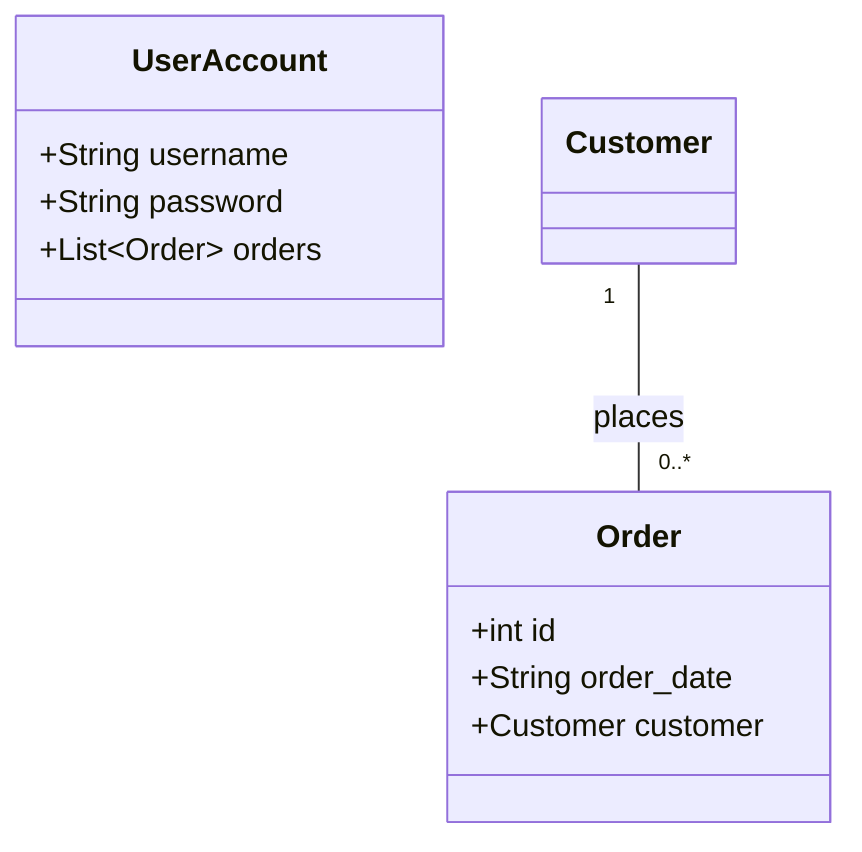

# 实体关系图

```mermaid
classDiagram
  class UserAccount {
    +String username
    +String password
    +List~Order~ orders
  }
  class Order {
    +int id
    +String order_date
    +Customer customer
  }
  Customer "1" -- "0..*" Order: places
```
