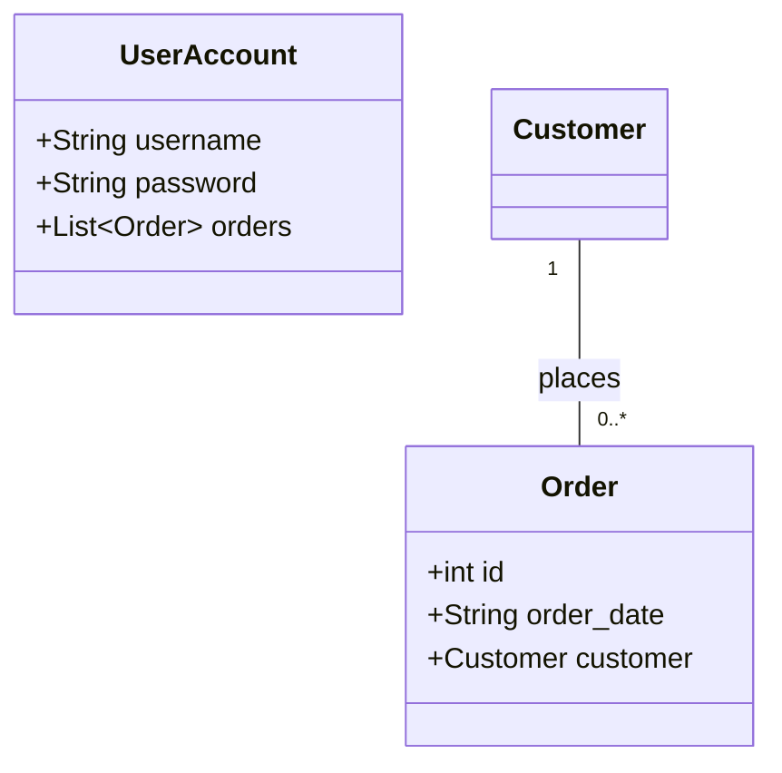

# 数据库与领域建模

## 数据库操作

### 重建 PostgreSQL 表主键自增 id

```postgresql
create sequence if not exists temp_seq start 1;
alter table if exists user_role_group
  drop column if exists id;
alter table if exists user_role_group
  add column if not exists id bigint not null default nextval('temp_seq'),
  add primary key (id);
alter sequence temp_seq restart with 1;
drop sequence if exists temp_seq cascade;
```

## 实体关系图


