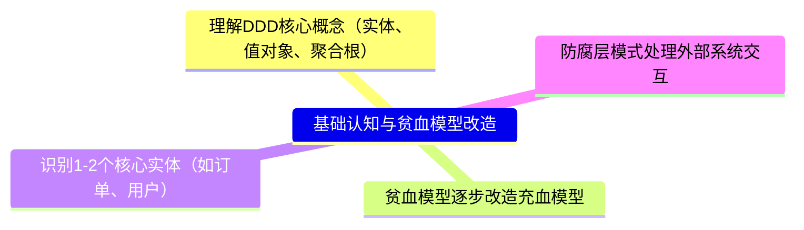
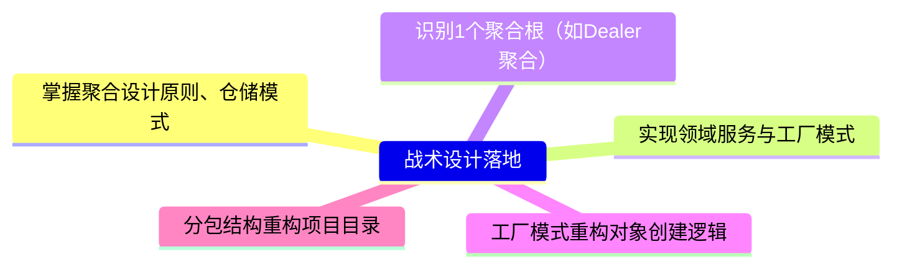
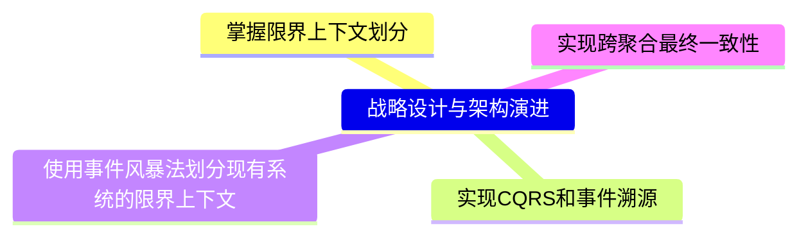
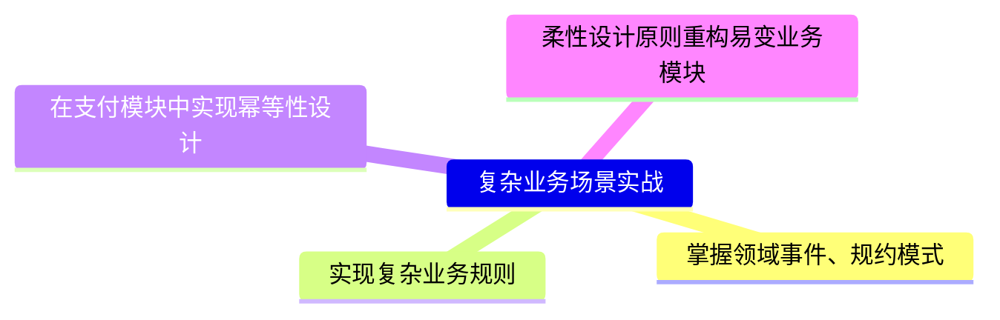

思维导图示例

```mermaid
mindmap
基础认知与贫血模型改造
  理解DDD核心概念（实体、值对象、聚合根）
  贫血模型逐步改造充血模型
  识别1-2个核心实体（如订单、用户）
  防腐层模式处理外部系统交互
```

```mermaid
mindmap
战术设计落地
  掌握聚合设计原则、仓储模式
  实现领域服务与工厂模式
  识别1个聚合根（如Dealer聚合）
  工厂模式重构对象创建逻辑
  分包结构重构项目目录
```

```mermaid
mindmap
战略设计与架构演进
  掌握限界上下文划分
  实现CQRS和事件溯源
  使用事件风暴法划分现有系统的限界上下文
  实现跨聚合最终一致性
```

```mermaid
mindmap
复杂业务场景实战
  掌握领域事件、规约模式
  实现复杂业务规则
  在支付模块中实现幂等性设计
  柔性设计原则重构易变业务模块
```

```mermaid
mindmap
工程化与效能提升
  结合DevOps实现领域驱动持续交付
  建立DDD质量防护体系
```
