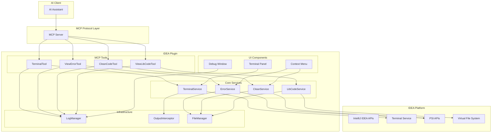

# Design Document

## Overview

本设计文档描述了 IntelliJ IDEA MCP 插件功能增强的技术架构和实现方案。该插件将扩展现有的基础 MCP 集成功能，提供终端命令执行、错误查看、代码清理、库代码查看等核心功能，并配备完整的用户界面和调试能力。

插件基于 IntelliJ Platform SDK 和 MCP（Model Context Protocol）协议构建，采用 Kotlin 语言开发，遵循 IDEA 插件开发最佳实践。

## Architecture

### 整体架构



### 分层架构

1. **MCP Tools Layer**: 实现 MCP 协议的具体工具，负责参数解析和结果返回
2. **Core Services Layer**: 核心业务逻辑服务，封装具体功能实现
3. **UI Components Layer**: 用户界面组件，提供可视化操作界面
4. **Infrastructure Layer**: 基础设施层，提供日志、文件管理等通用功能

## Components and Interfaces

### MCP Tools

#### TerminalTool
```kotlin
class TerminalTool : AbstractMcpTool<TerminalArgs> {
    override val name: String = "terminal"
    override val description: String = "Execute terminal commands with clean output"
    
    override fun handle(project: Project, args: TerminalArgs): Response
}

@Serializable
data class TerminalArgs(
    val command: String,
    val workingDirectory: String? = null,
    val timeout: Long = 30000,
    val cleanOutput: Boolean = true
)
```

#### ViewErrorTool
```kotlin
class ViewErrorTool : AbstractMcpTool<ViewErrorArgs> {
    override val name: String = "view_error"
    override val description: String = "View all errors, warnings in files or directories"
    
    override fun handle(project: Project, args: ViewErrorArgs): Response
}

@Serializable
data class ViewErrorArgs(
    val path: String,
    val includeWarnings: Boolean = true,
    val includeWeakWarnings: Boolean = true
)
```

#### CleanCodeTool
```kotlin
class CleanCodeTool : AbstractMcpTool<CleanCodeArgs> {
    override val name: String = "clean_code"
    override val description: String = "Clean and format code using IDEA capabilities"
    
    override fun handle(project: Project, args: CleanCodeArgs): Response
}

@Serializable
data class CleanCodeArgs(
    val path: String,
    val formatCode: Boolean = true,
    val optimizeImports: Boolean = true,
    val runInspections: Boolean = true
)
```

#### ViewLibCodeTool
```kotlin
class ViewLibCodeTool : AbstractMcpTool<ViewLibCodeArgs> {
    override val name: String = "view_lib_code"
    override val description: String = "View library source code or decompiled code"
    
    override fun handle(project: Project, args: ViewLibCodeArgs): Response
}

@Serializable
data class ViewLibCodeArgs(
    val filePath: String,
    val fullyQualifiedName: String,
    val memberName: String? = null
)
```

### Core Services

#### TerminalService
```kotlin
interface TerminalService {
    suspend fun executeCommand(
        project: Project,
        command: String,
        workingDirectory: String? = null,
        timeout: Long = 30000
    ): TerminalResult
    
    fun cleanOutput(rawOutput: String, commandType: CommandType): String
}

data class TerminalResult(
    val exitCode: Int,
    val output: String,
    val errorOutput: String,
    val executionTime: Long,
    val command: String
)

enum class CommandType {
    GRADLE, MAVEN, NPM, NPX, GENERIC
}
```

#### ErrorService
```kotlin
interface ErrorService {
    fun collectErrors(project: Project, path: String): List<ErrorInfo>
    fun analyzeFile(project: Project, virtualFile: VirtualFile): List<ErrorInfo>
}

data class ErrorInfo(
    val filePath: String,
    val line: Int,
    val column: Int,
    val severity: ErrorSeverity,
    val message: String,
    val code: String,
    val quickFixes: List<String> = emptyList()
)

enum class ErrorSeverity {
    ERROR, WARNING, WEAK_WARNING, INFO
}
```

#### CleanService
```kotlin
interface CleanService {
    suspend fun cleanCode(
        project: Project, 
        path: String, 
        options: CleanOptions
    ): CleanResult
}

data class CleanOptions(
    val formatCode: Boolean = true,
    val optimizeImports: Boolean = true,
    val runInspections: Boolean = true,
    val rearrangeCode: Boolean = false
)

data class CleanResult(
    val processedFiles: Int,
    val modifiedFiles: Int,
    val errors: List<String>,
    val summary: String
)
```

#### LibCodeService
```kotlin
interface LibCodeService {
    suspend fun getLibraryCode(
        project: Project,
        filePath: String,
        fullyQualifiedName: String,
        memberName: String? = null
    ): LibCodeResult
}

data class LibCodeResult(
    val sourceCode: String,
    val isDecompiled: Boolean,
    val language: String,
    val metadata: LibCodeMetadata
)

data class LibCodeMetadata(
    val libraryName: String,
    val version: String?,
    val sourceType: SourceType,
    val documentation: String?
)

enum class SourceType {
    SOURCE_JAR, DECOMPILED, NOT_FOUND
}
```

### UI Components

#### McpDebugToolWindow
```kotlin
class McpDebugToolWindow(private val project: Project) {
    private val logPanel: LogPanel
    private val terminalPanel: TerminalPanel
    private val fileOperationPanel: FileOperationPanel
    
    fun createContent(): JComponent
    fun updateLogs(logs: List<LogEntry>)
    fun exportLogs()
    fun clearLogs()
}
```

#### ContextMenuActions
```kotlin
class CleanCodeAction : AnAction() {
    override fun actionPerformed(e: AnActionEvent)
}

class ViewErrorAction : AnAction() {
    override fun actionPerformed(e: AnActionEvent)
}

class ViewLibCodeAction : AnAction() {
    override fun actionPerformed(e: AnActionEvent)
}
```

### Infrastructure Components

#### OutputInterceptor
```kotlin
class OutputInterceptor {
    fun interceptTerminalOutput(output: String): String
    fun cleanGradleOutput(output: String): String
    fun cleanMavenOutput(output: String): String
    fun cleanNpmOutput(output: String): String
    fun removeAnsiCodes(output: String): String
    fun extractKeyInformation(output: String, commandType: CommandType): String
}
```

#### FileManager
```kotlin
class FileManager {
    fun resolvePathToVirtualFile(project: Project, path: String): VirtualFile?
    fun collectFilesRecursively(virtualFile: VirtualFile, filter: (VirtualFile) -> Boolean): List<VirtualFile>
    fun isValidPath(path: String): Boolean
    fun getRelativePath(project: Project, virtualFile: VirtualFile): String
}
```

## Data Models

### Response Models

#### AI-Friendly Response Format
```kotlin
@Serializable
data class McpResponse<T>(
    val success: Boolean,
    val data: T? = null,
    val error: ErrorDetails? = null,
    val metadata: ResponseMetadata
)

@Serializable
data class ErrorDetails(
    val type: String,
    val message: String,
    val suggestions: List<String> = emptyList(),
    val stackTrace: String? = null
)

@Serializable
data class ResponseMetadata(
    val executionTime: Long,
    val timestamp: String,
    val tool: String,
    val version: String = "1.0.0"
)
```

#### Structured Output Models
```kotlin
@Serializable
data class TerminalOutput(
    val command: String,
    val exitCode: Int,
    val output: String,
    val cleanedOutput: String,
    val executionTime: Long,
    val workingDirectory: String
)

@Serializable
data class ErrorReport(
    val path: String,
    val totalErrors: Int,
    val totalWarnings: Int,
    val files: List<FileErrorInfo>
)

@Serializable
data class FileErrorInfo(
    val filePath: String,
    val errors: List<ErrorInfo>,
    val summary: String
)

@Serializable
data class CleanReport(
    val processedFiles: Int,
    val modifiedFiles: Int,
    val operations: List<CleanOperation>,
    val summary: String
)

@Serializable
data class CleanOperation(
    val type: String,
    val description: String,
    val filesAffected: Int
)
```

## Error Handling

### Error Categories
1. **User Input Errors**: 无效路径、错误参数格式
2. **System Errors**: 文件权限、进程执行失败
3. **IDEA API Errors**: PSI 访问异常、VFS 错误
4. **Timeout Errors**: 长时间运行的命令超时

### Error Handling Strategy
```kotlin
sealed class McpError(val message: String, val suggestions: List<String> = emptyList()) {
    class InvalidPath(path: String) : McpError(
        "Invalid path: $path",
        listOf("Check if path exists", "Use absolute or relative path from project root")
    )
    
    class CommandTimeout(command: String, timeout: Long) : McpError(
        "Command timed out after ${timeout}ms: $command",
        listOf("Increase timeout", "Check if command is hanging", "Use simpler command")
    )
    
    class PermissionDenied(path: String) : McpError(
        "Permission denied: $path",
        listOf("Check file permissions", "Run IDEA with appropriate privileges")
    )
    
    class LibraryNotFound(className: String) : McpError(
        "Library class not found: $className",
        listOf("Check if library is in classpath", "Verify class name spelling", "Refresh project")
    )
}
```

## Testing Strategy

### Unit Testing
- **Service Layer**: 使用 MockK 模拟 IDEA API 依赖
- **Tool Layer**: 测试 MCP 工具的参数解析和响应格式
- **Utility Classes**: 测试输出清洗、文件处理等工具方法

### Integration Testing
- **IDEA Platform Integration**: 使用 IDEA 测试框架测试与平台的集成
- **Terminal Integration**: 测试终端命令执行和输出拦截
- **File System Integration**: 测试文件操作和路径解析

### Test Structure
```kotlin
class TerminalServiceTest {
    @MockK private lateinit var project: Project
    @MockK private lateinit var terminalRunner: TerminalRunner
    
    private lateinit var terminalService: TerminalService
    
    @BeforeEach
    fun setup() {
        MockKAnnotations.init(this)
        terminalService = TerminalServiceImpl(terminalRunner)
    }
    
    @Test
    fun `should execute simple command successfully`() {
        // Given
        val command = "echo 'hello world'"
        every { terminalRunner.execute(any(), any()) } returns TerminalResult(0, "hello world\n", "", 100, command)
        
        // When
        val result = runBlocking { terminalService.executeCommand(project, command) }
        
        // Then
        assertEquals(0, result.exitCode)
        assertEquals("hello world", result.output.trim())
    }
}
```

### Performance Testing
- **Memory Usage**: 监控日志管理器的内存使用
- **Response Time**: 测试各种工具的响应时间
- **Concurrent Access**: 测试多个 MCP 请求的并发处理

## Implementation Notes

### 技术栈集成
- **IntelliJ Platform SDK**: 2025.2+
- **Kotlin**: 2.2.0
- **Kotlinx Serialization**: JSON 序列化
- **Coroutines**: 异步操作处理
- **SLF4J**: 日志框架

### 关键实现细节
1. **终端集成**: 使用 IDEA 的 `TerminalService` API 而不是直接执行系统命令
2. **PSI 访问**: 在 EDT 线程外使用 `ReadAction` 访问 PSI
3. **文件监听**: 使用 `VirtualFileListener` 监听文件变化
4. **异步处理**: 使用 Kotlin Coroutines 处理长时间运行的操作
5. **内存管理**: 实现日志轮转和缓存清理机制

### 扩展点配置
```xml
<extensions defaultExtensionNs="com.intellij.mcpServer">
    <mcpTool implementation="io.github.truenine.composeserver.ide.ideamcp.tools.TerminalTool"/>
    <mcpTool implementation="io.github.truenine.composeserver.ide.ideamcp.tools.ViewErrorTool"/>
    <mcpTool implementation="io.github.truenine.composeserver.ide.ideamcp.tools.CleanCodeTool"/>
    <mcpTool implementation="io.github.truenine.composeserver.ide.ideamcp.tools.ViewLibCodeTool"/>
</extensions>

<extensions defaultExtensionNs="com.intellij">
    <toolWindow id="McpDebug" displayName="MCP Debug" 
                anchor="bottom" 
                factoryClass="io.github.truenine.composeserver.ide.ideamcp.ui.McpDebugToolWindowFactory"/>
    
    <projectService serviceImplementation="io.github.truenine.composeserver.ide.ideamcp.services.TerminalService"/>
    <projectService serviceImplementation="io.github.truenine.composeserver.ide.ideamcp.services.ErrorService"/>
    <projectService serviceImplementation="io.github.truenine.composeserver.ide.ideamcp.services.CleanService"/>
    <projectService serviceImplementation="io.github.truenine.composeserver.ide.ideamcp.services.LibCodeService"/>
</extensions>

<actions>
    <group id="McpActions" text="MCP Actions" popup="true">
        <action id="CleanCode" class="io.github.truenine.composeserver.ide.ideamcp.actions.CleanCodeAction"/>
        <action id="ViewError" class="io.github.truenine.composeserver.ide.ideamcp.actions.ViewErrorAction"/>
        <action id="ViewLibCode" class="io.github.truenine.composeserver.ide.ideamcp.actions.ViewLibCodeAction"/>
        <add-to-group group-id="EditorPopupMenu" anchor="last"/>
        <add-to-group group-id="ProjectViewPopupMenu" anchor="last"/>
    </group>
</actions>
```