# 关联关系

每个实体都继承 `AnyEntity`、`IEntity`、`ITreeEntity` 等的关系实体。

### 基础表定义

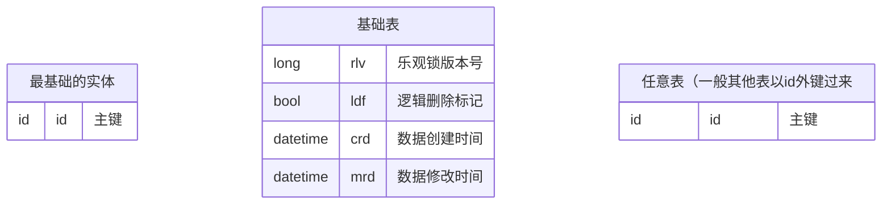

### 线索树表表示法

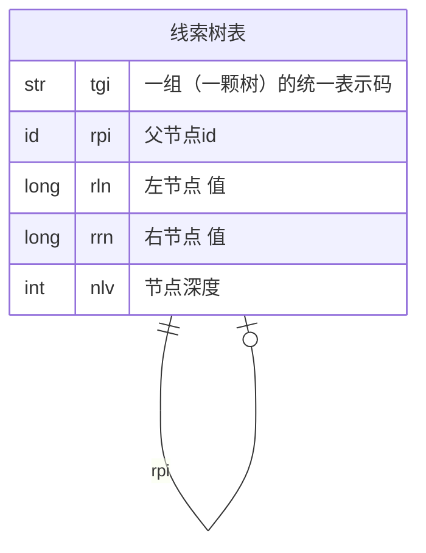

### 用户

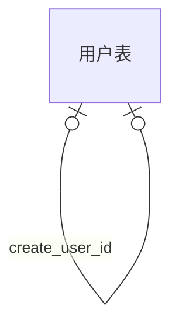

### 用户信息

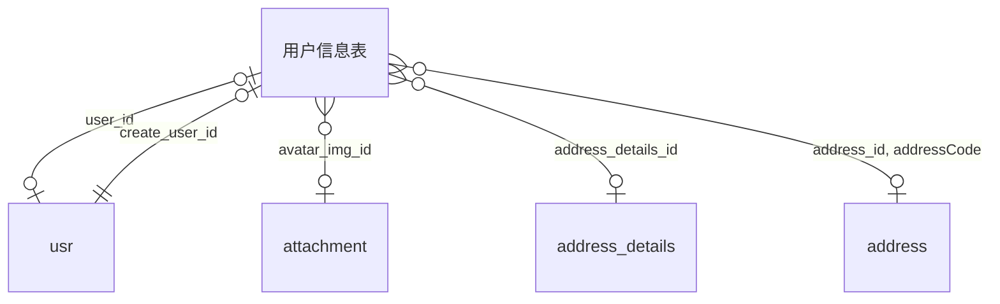

### rbac 角色、角色组、权限

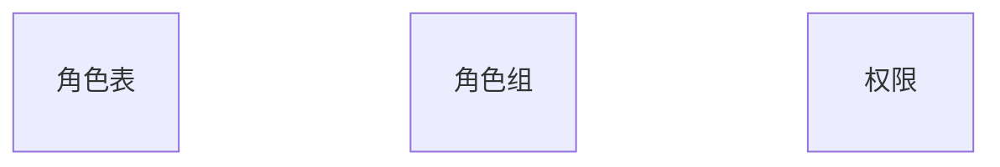

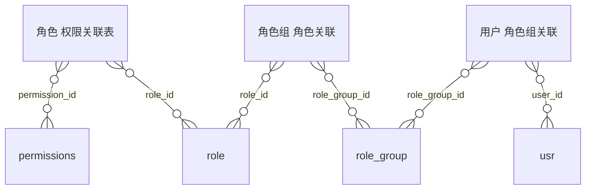

### 部门

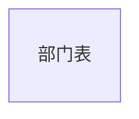

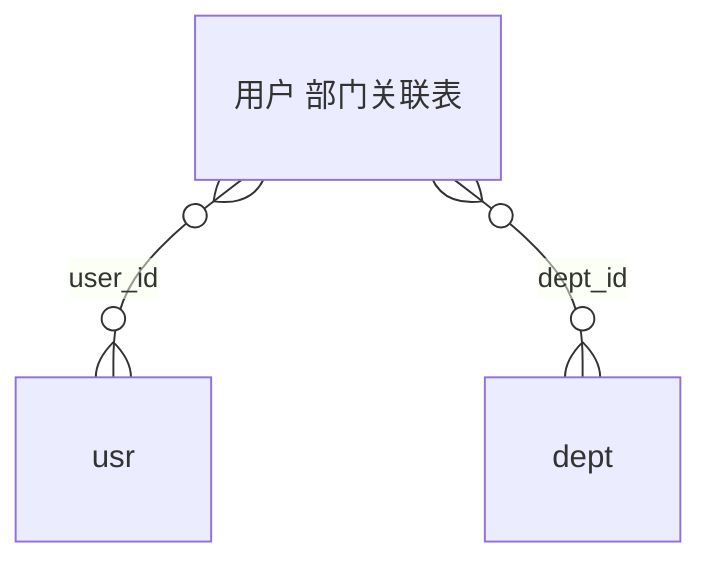

### 接口

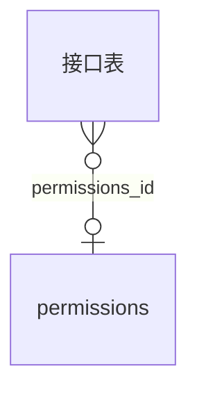

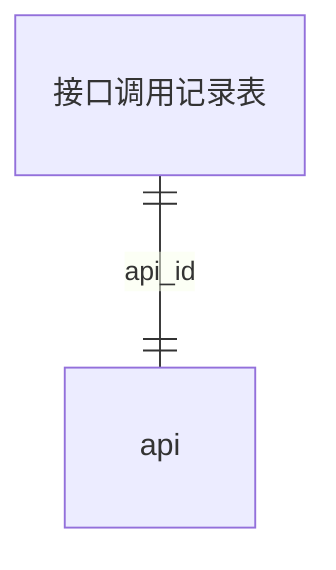

### 附件

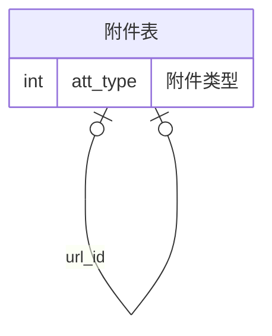

### 地址

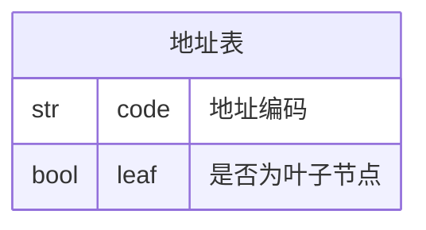

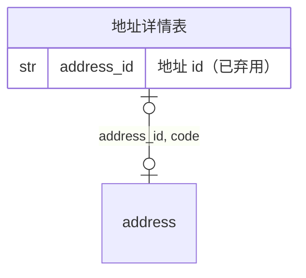

### 表变更记录

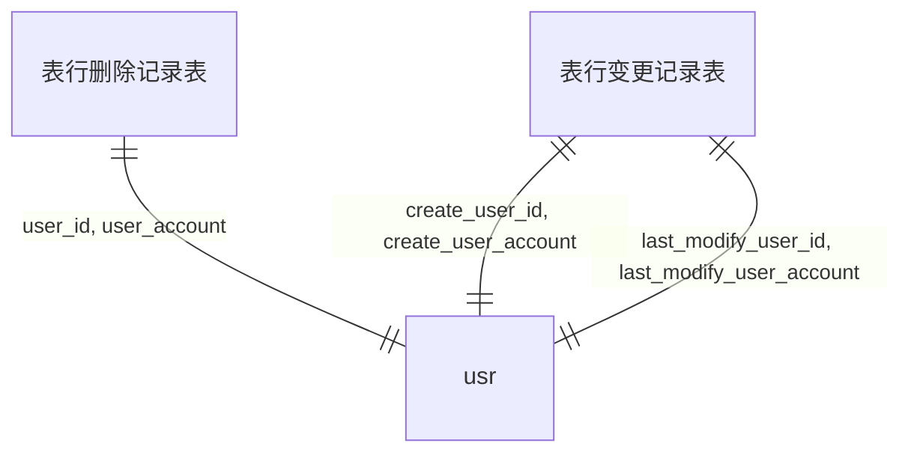

### 证件

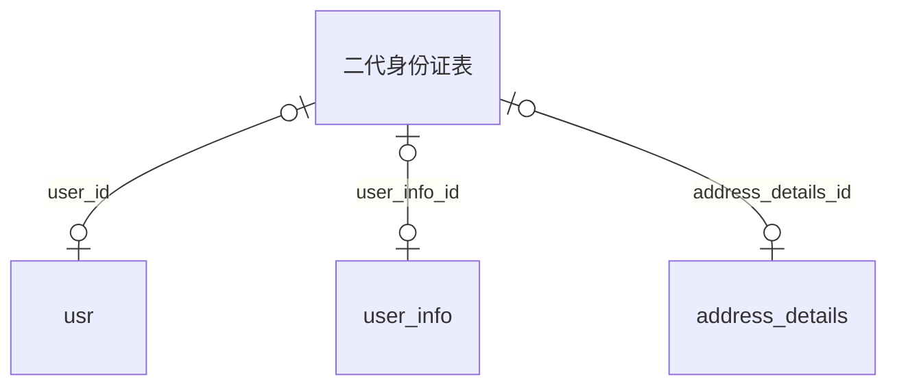

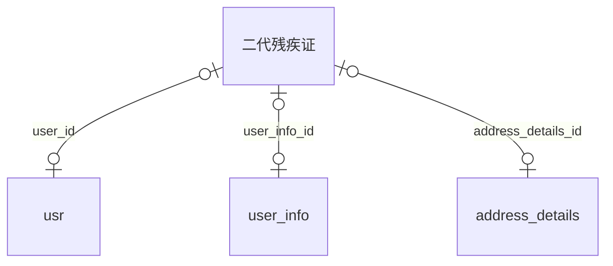

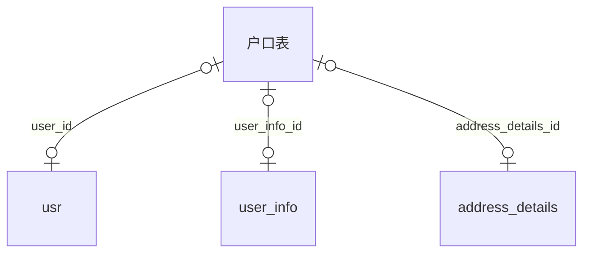

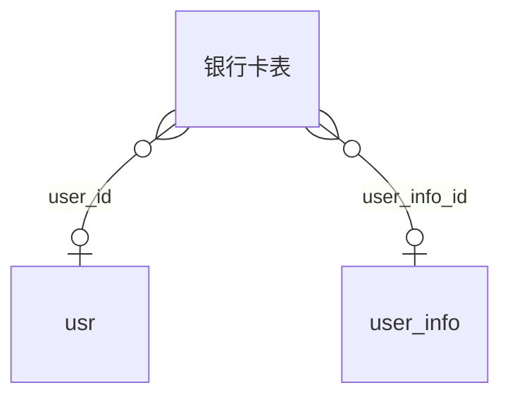

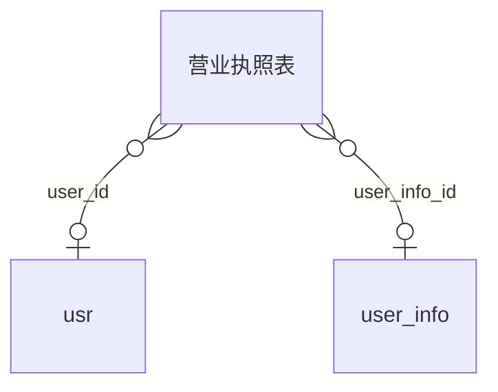

### 审核审计表

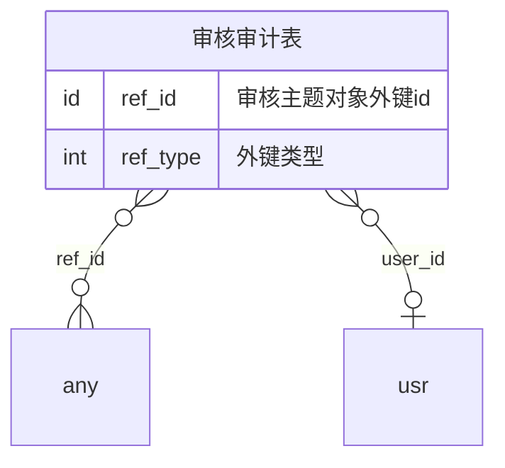
```mermaid
erDiagram
  audit_attachment["审核附件表"]
  audit_attachment }o--|| audit: audit_id
  audit_attachment }o--|| attachment: att_id
```
### 证件关联

```mermaid
erDiagram
  cert["证件表"] {
    str wm_code "证件水印码"
    id wm_att_id "水印文件"
    id att_id "证件源文件"
  }
  cert |o--o| usr: user_id
  cert |o--|| usr: create_user_id
  cert |o--o| user_info: user_info_id
  cert |o--|| attachment: att_id
  cert |o--|| attachment: wm_att_id
```
